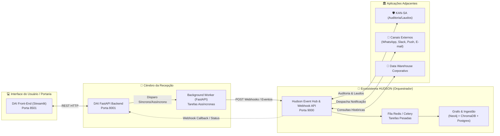

# 📡 Especificação de Integração Oficial: DAI Smart Reception × HUDSON Core
**Ecossistema:** Daisugi Tecnologias  
**Sistemas Integrados:**  
- 🌸 **DAI Smart Reception Framework:** (Front-End Streamlit + Back-End FastAPI Porta `8001` / `dai.daisugi.com.br`)  
- 🤖 **HUDSON Core:** (Orquestrador, Event Hub & Webhook Broker Porta `9000` / `hudson.daisugi.com.br`)  
**Versão do Contrato:** `v1.2.0`  
**Data:** Outubro de 2026  
**Status:** 🚀 **HOMOLOGADO PARA IMPLEMENTAÇÃO NO HUDSON**  

---

## 1. Visão Geral e Papéis no Ecossistema

O ecossistema Daisugi baseia-se no desacoplamento entre a **face empática de atendimento (DAI)** e o **orquestrador sistêmico de eventos e investigações (HUDSON)**.



| Sistema | Responsabilidade | Comportamento de I/O |
| :--- | :--- | :--- |
| **DAI** | Acolhimento, triagem, linguagem natural, emissão de tickets/QR Code e interface com visitantes/anfitriões. | **Baixa Latência (<400ms)**. Não pode sofrer *hanging request* nem esperar tarefas pesadas. |
| **HUDSON** | Orquestração de mensageria, eventos corporativos, motor de sindicância, grafos de relacionamento, disparo de notificações aos anfitriões e ponte com o Kan-sa. | **Assíncrono & Orientado a Eventos**. Processa em filas distribuídas (Celery/Redis) e notifica via webhooks. |

---

## 2. Topologia de Rede & Endpoints

### 2.1. Ambiente Oracle Cloud (Produção OCI)
- **Rede Docker:** `daisugi-net` (Bridge Network interna)
- **Hostname Interno:** `http://hudson:9000`
- **Domínio Público com TLS:** `https://hudson.daisugi.com.br`
- **Proxy Reverso:** Caddy Server gerenciando terminação TLS 1.3

### 2.2. Variáveis de Ambiente no Back-End da DAI
```env
HUDSON_API_URL=http://hudson:9000
HUDSON_WEBHOOK_SECRET=daisugi_hudson_secret_sha256_shared_key
HUDSON_TOKEN_JWT=token_jwt_operador_secreto
HUDSON_TIMEOUT_SECONDS=3.0
```

---

## 3. Contratos de APIs: Eventos Disparados pela DAI para o HUDSON

### 🔹 Evento 1: Notificação de Anfitrião (Tab 2 do Front-End)
**Gatilho:** O visitante ou operador clica em `🔔 Notificar Anfitrião` nos Cards das Salas autorizadas.

- **Método HTTP:** `POST`
- **Rota no HUDSON:** `/api/v1/eventos/notificar-anfitriao`
- **Headers:**
  ```http
  Content-Type: application/json
  Authorization: Bearer <HUDSON_TOKEN_JWT>
  X-Daisugi-Signature: sha256=<HMAC_HEX>
  ```
- **Payload Enviado pela DAI:**
  ```json
  {
    "evento": "DAI_NOTIFICAR_ANFITRIAO",
    "timestamp": "2026-10-05T16:00:00Z",
    "ticket_id": "TKT-DAI-2026-70FE7F",
    "sala_destino": "Governança de Travas ERP",
    "departamento": "Controladoria & Auditoria",
    "visitante": {
      "id_usuario": 4,
      "nome": "Controller Geral (Checker Quarentena)",
      "perfil_pam": "admin",
      "unidades_autorizadas": ["controladoria", "juridico"]
    },
    "anfitriao_alvo": {
      "canal_preferencial": "slack_and_push",
      "mensagem": "O visitante Controller Geral realizou check-in na portaria e aguarda liberação para a sala Governança de Travas ERP."
    }
  }
  ```
- **Resposta Esperada do HUDSON (HTTP 200 OK ou 202 Accepted):**
  ```json
  {
    "status": "ACCEPTED",
    "id_despacho": "DSP-HUDSON-994821",
    "canais_acionados": ["slack", "push_mobile"],
    "tempo_estimado_entrega": "< 2s"
  }
  ```

---

### 🔹 Evento 2: Quarentena e Auditoria de Documento / CCB (Integração Kan-sa)
**Gatilho:** O validador da Cadeira PAM envia um documento para auditoria via rota `/api/quarentena/validar` da Dai. O worker assíncrono conclui a análise inicial e despacha a ordem para o Hudson.

- **Método HTTP:** `POST`
- **Rota no HUDSON:** `/api/v1/webhooks/quarentena-auditoria`
- **Headers:**
  ```http
  Content-Type: application/json
  Authorization: Bearer <HUDSON_TOKEN_JWT>
  ```
- **Payload Enviado pela DAI:**
  ```json
  {
    "evento": "DAI_QUARENTENA_SUBMETIDA",
    "timestamp": "2026-10-05T16:03:00Z",
    "hash_documento": "sha256_live_check_999",
    "status_parecer": "APROVADO",
    "maker": "engenheiro.obra@sugoisa.com.br",
    "checker": "controller@sugoisa.com.br",
    "sod_validado": true,
    "metadados": {
      "tipo_documento": "CCB_MEDICAO_OBRAS",
      "unidade": "sugoi_sa",
      "valor_declarado": 450000.00
    },
    "destino_kansa": "esteira_pericial_automatica"
  }
  ```
- **Ação Executada pelo HUDSON:**
  - O Hudson encaminha o hash para a fila Celery para ser processado no Kan-sa.
  - Alimenta o grafo de relações no Neo4j correlacionando o fornecedor, o imóvel e o engenheiro.

---

### 🔹 Evento 3: Alerta de Situação Extraordinária / Emergência (Dr. SaulLM)
**Gatilho:** Identificação de mandado judicial, fiscalização ou risco crítico durante o diálogo no Lobby.

- **Método HTTP:** `POST`
- **Rota no HUDSON:** `/api/v1/alertas/emergencia`
- **Payload Enviado pela DAI:**
  ```json
  {
    "evento": "ALERTA_EMERGENCIA_P1",
    "nivel_prioridade": "P1_CRITICO",
    "timestamp": "2026-10-05T16:05:00Z",
    "ticket_id": "TKT-DAI-EMERG-001",
    "descricao": "Portador de ordem judicial / vistoria extraordinária no térreo.",
    "localizacao": "Lobby Principal - Balcão da Dai",
    "acao_imediata": "Acolhimento na Sala Executiva Térrea realizado. Solicita-se presença imediata de Advogado e Diretor de Operações."
  }
  ```
- **Ação Executada pelo HUDSON:**
  - Disparo de sirene/alerta push sonoro no painel da Segurança Patrimonial e Diretoria Jurídica.

---

### 🔹 Evento 4: Consulta Semântica ao Grafo / Histórico de Sindicâncias
**Gatilho:** A Dai recebe uma consulta de visitante corporativo com nome ambíguo ou necessita confirmar histórico de relacionamento empresarial mantido no Hudson.

- **Método HTTP:** `GET`
- **Rota no HUDSON:** `/api/v1/grafo/consultar-entidade?termo={nome_ou_cnpj}`
- **Resposta do HUDSON para a DAI:**
  ```json
  {
    "encontrado": true,
    "entidade": {
      "nome": "Ronaldo Akagui",
      "cargo": "Diretoria Executiva / Controller",
      "departamento": "Controladoria",
      "grau_risco": "BAIXO",
      "relacionamentos_ativos": ["SUGOI S.A.", "DAISUGI ALPHA"]
    }
  }
  ```

---

## 4. Callbacks e Webhooks de Retorno (HUDSON ➔ DAI)

Quando o anfitrião responde à notificação ou o Kan-sa finaliza um laudo pesado, o HUDSON emite um webhook de retorno para o Back-End da DAI:

- **Rota na DAI:** `POST http://dai:8001/api/webhooks/hudson-callback`
- **Payload do Callback:**
  ```json
  {
    "id_evento_origem": "DSP-HUDSON-994821",
    "ticket_id": "TKT-DAI-2026-70FE7F",
    "tipo_retorno": "ANFITRIAO_RESPONDEU",
    "status": "AUTORIZADO",
    "resposta_anfitriao": "Estou descendo para recepcionar o convidado na recepção.",
    "catraca_liberada": true,
    "timestamp": "2026-10-05T16:01:15Z"
  }
  ```

---

## 5. Políticas de Homeostase e Resiliência (Tolerância a Falhas)

1. **Timeout Curto na DAI (3 Segundos Máximo):**
   - A chamada REST da Dai para o Hudson tem timeout rígido de **3.0 segundos**. Se o Hudson demorar para enfileirar, a Dai não trava a tela do visitante; ela devolve: *"Sua solicitação foi anotada e o sistema central está confirmando o agendamento em segundo plano."*
2. **Exponential Backoff & Retries no Worker:**
   - Em caso de falha de conexão (código HTTP 5xx ou Timeout), o background worker tenta retransmitir o evento em: **1s, 5s e 30s**.
3. **Idempotência por `ticket_id`:**
   - Todo payload carrega `ticket_id` único. O Hudson descarta eventos duplicados recebidos no intervalo de 10 minutos.

---

## 6. Checklist de Implementação para o Chat do HUDSON

Para que a equipe do HUDSON configure sua ponta com 100% de compatibilidade:

- [ ] Subir FastAPI na porta `9000` (exposta no Caddy como `hudson.daisugi.com.br`).
- [ ] Implementar a rota `POST /api/v1/eventos/notificar-anfitriao`.
- [ ] Implementar a rota `POST /api/v1/webhooks/quarentena-auditoria`.
- [ ] Configurar o canal Celery/Redis para consumir as tarefas sem latência síncrona.
- [ ] Implementar a rota de Callback disparando para `http://dai:8001/api/webhooks/hudson-callback`.
- [ ] Validar o token Bearer `token_jwt_operador_secreto` no middleware de segurança.
