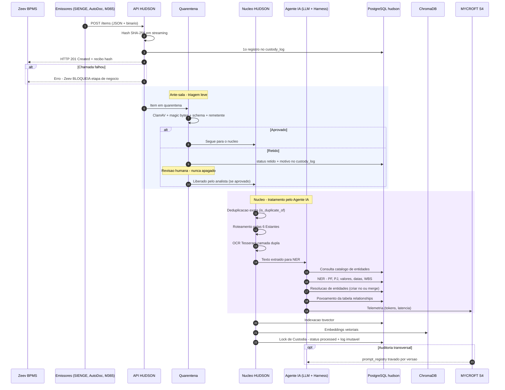
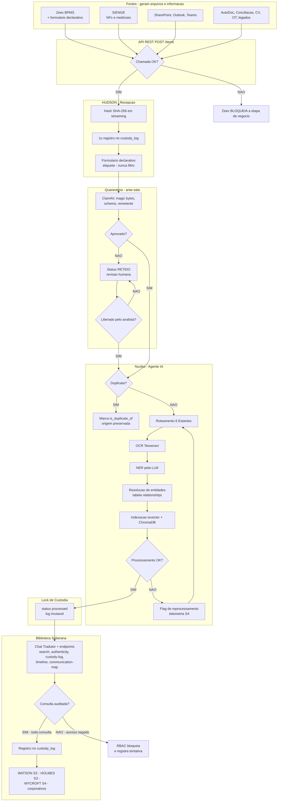

# HUDSON S1 — Arquitetura do Sistema

Custodiante forense e data warehouse do ecossistema (HUDSON S1, WATSON S2, HOLMES S3, MYCROFT S4). Hash SHA-256 em streaming e `custody_log` append-only garantem a cadeia de custódia de tudo que entra no acervo.

Este repositório reúne os cinco diagramas de arquitetura do desenho do sistema, em Mermaid: contexto (C4 Nível 1), containers (C4 Nível 2), componentes do Agente de IA (C4 Nível 3), sequência de ingestão e o flowchart completo.

## ⚠️ Notas técnicas sobre os diagramas C4 (Níveis 1, 2 e 3)

O suporte a C4 (`C4Context`, `C4Container`, `C4Component`) no Mermaid é experimental e varia entre versões de renderizador. Dois problemas foram encontrados e testados neste ambiente (mermaid-cli 11.14.0):

1. **`SHOW_LEGEND()` quebra o parser** — em todos os três diagramas C4, a diretiva `SHOW_LEGEND()` no fim do bloco causa "Lexical error". O restante de cada diagrama renderiza normalmente sem essa linha. Os arquivos mantêm `SHOW_LEGEND()` porque pode funcionar em outros renderizadores (ex.: mermaid.live com versão mais nova, ou o preview nativo do GitHub); se o C4 não renderizar no seu visualizador, remova essa linha, ou use o Flowchart (item 5), validado e 100% estável.
2. **`Container_Bound` não é um macro válido** — os diagramas de Nível 2 e 3, como escritos originalmente, usavam `Container_Bound(...)`. O nome correto do macro no Mermaid é `Container_Boundary(...)`. Esse é um erro de sintaxe genuíno (não uma questão de versão do renderizador) e foi corrigido nos arquivos `.mmd` deste repositório — sem a correção, o diagrama não renderiza em nenhum visualizador Mermaid.

## Diagramas

### 1. C4 Model — Contexto (Nível 1)

`01-c4-contexto.mmd`

```mermaid
C4Context
  title C4 Nivel 1 - Contexto do Sistema HUDSON S1

  Person(corporativo, "Consumidor Corporativo", "Advogado, gestor, auditor, due diligence e setores")
  Person(analista, "Analista de Quarentena", "Revisa itens retidos - nunca apaga")
  Person(gov, "Gestor de Governanca S4", "Aprova versoes do System Prompt")

  System(hudson, "HUDSON S1", "Custodiante forense e data warehouse - hash SHA-256 e custody_log append-only")
  System(watson, "WATSON S2", "Auditoria do acervo")
  System(holmes, "HOLMES S3", "Sindicancia - somente leitura")
  System(mycroft, "MYCROFT S4", "Governanca de IA - telemetria e prompt_registry")

  System_Ext(zeev, "Zeev BPMS", "Orquestra tarefas e mantem travas de ingestao")
  System_Ext(sienge, "SIENGE", "ERP - NFs, ordens e medicoes")
  System_Ext(autodoc, "AutoDoc", "Pranchas de projeto e ARTs")
  System_Ext(bancaria, "Conciliacao Bancaria", "Comprovantes e extratos")
  System_Ext(m365, "Microsoft 365", "SharePoint, Outlook e Teams")
  System_Ext(legados, "Legados", "SMB/NFS e caixas pst e msg")

  Rel(sienge, hudson, "Envia PDFs e XMLs por evento de negocio", "Webhook POST /items")
  Rel(autodoc, hudson, "Envia pranchas e ARTs", "Webhook POST /items")
  Rel(bancaria, hudson, "Envia comprovantes apos liquidacao", "Webhook POST /items")
  Rel(zeev, hudson, "Envia arquivos e formulario declarativo - espera recibo", "POST /items - HTTP 201")
  Rel(m365, hudson, "Documentos, e-mails e mensagens", "Graph API - conector unico")
  Rel(legados, hudson, "Varredura passiva agendada", "Celery Workers read-only")
  Rel(corporativo, hudson, "Consulta o acervo", "Chat Tradutor e endpoints de leitura")
  Rel(analista, hudson, "Revisa itens retidos", "Fila de revisao humana")
  Rel(holmes, hudson, "Consome o banco para sindicancia", "APIs de leitura auditada")
  Rel(watson, hudson, "Reporta falha de indexacao ou entidade omitida", "s1_audit_findings")
  Rel(hudson, mycroft, "Registra tokens e latencia de LLM", "llmops_telemetry")
  Rel(gov, mycroft, "Aprova ou bloqueia versoes de prompt", "prompt_registry")

  SHOW_LEGEND()
```

### 2. Sequência — Ingestão e Processamento

`02-sequencia-ingestao.mmd` — validado (renderiza sem erros).



### 3. C4 Model — Containers (Nível 2)

`04-c4-container-nivel2.mmd` — validado após a correção `Container_Bound` → `Container_Boundary` (ver nota técnica acima); renderiza sem erros sem o `SHOW_LEGEND()` final.

```mermaid
C4Container
  title C4 Nivel 2 - Containers do HUDSON S1

  Person(corporativo, "Consumidor Corporativo", "Advogado, gestor, auditor, due diligence")
  Person(analista, "Analista de Quarentena", "Revisa itens retidos - nunca apaga")
  Person(usu, "Usuario do Canal Humano", "Preenche formulario no Zeev")

  System_Ext(zeev, "Zeev BPMS", "Orquestra e trava etapas de negocio")
  System_Ext(sistemas, "SIENGE, AutoDoc, Conciliacao, CV, OT", "Emissores por webhook")
  System_Ext(m365, "Microsoft 365", "SharePoint, Outlook e Teams")
  System_Ext(legados, "Legados", "SMB/NFS e caixas pst/msg")
  System_Ext(watson, "WATSON S2", "Auditoria do acervo")
  System_Ext(holmes, "HOLMES S3", "Sindicancia - leitura")
  System_Ext(mycroft, "MYCROFT S4", "Governanca de IA")
  System_Ext(llm, "LLM Provider", "Modelo de linguagem - motor NER e tradutor")

  Container_Boundary(hb, "HUDSON S1", "Ubuntu Server - Docker Compose"){

    Container(api, "API REST", "FastAPI", "POST /items - endpoints de leitura - contratos deterministicos")

    Container(quar, "Quarentena - Ante-sala", "ClamAV + python-magic + Pydantic", "Triagem leve e adaptador de formato dos 6 emissores")

    Container(agents, "Celery Workers", "Python", "OCR transcricao varredura passiva e indexacao")

    ContainerDb(pg, "PostgreSQL hudson", "PostgreSQL 15", "Entidades relationships tsvector e custody_log append-only")

    ContainerDb(redis, "Redis", "Redis", "Filas Celery e amortecimento de picos")

    ContainerDb(vdb, "ChromaDB", "ChromaDB", "Embeddings e busca vetorial")

    ContainerDb(storage, "Object Storage", "Imutavel", "Binarios originais - nunca sobrescritos - storage_path")

    Container(agent, "Agente de IA", "LLM + Harness", "NER resolucao de entidades e Chat Tradutor - vedacoes no System Prompt")
  }

  Rel(sistemas, api, "Envia JSON + binario", "Webhook POST /items")
  Rel(zeev, api, "Arquivo + formulario declarativo", "POST /items - espera HTTP 201")
  Rel(api, zeev, "Recibo SHA-256 ou erro de trava", "HTTP 201 / timeout")
  Rel(m365, api, "Documentos e-mails mensagens", "Graph API conector unico")
  Rel(legados, agents, "Varredura agendada read-only", "SMB/NFS pst/msg")
  Rel(usu, zeev, "Preenche formulario declarativo", "4 campos minimos")

  Rel(api, quar, "Item recebido para triagem", "Interno")
  Rel(quar, agents, "Aprovado entra no nucleo", "Fila Redis")
  Rel(quar, pg, "Status retido + motivo", "custody_log")
  Rel(analista, quar, "Revisa e libera itens retidos", "Fila de revisao")

  Rel(agents, agent, "Texto extraido para NER e resolucao", "Interno")
  Rel(agent, llm, "Chamadas de inferencia", "API - telemetria obrigatoria")
  Rel(agent, pg, "Catalogo de entidades e relationships", "Leitura e escrita controlada")
  Rel(agents, storage, "Grava original una vez", "Object Storage imutavel")
  Rel(agents, pg, "Indexacao tsvector e lock de custodia", "custody_log")
  Rel(agents, vdb, "Indexacao vetorial", "Embeddings")

  Rel(corporativo, api, "Consulta via Chat Tradutor e endpoints", "/search /authenticity /custody-log /timeline")
  Rel(holmes, api, "Consome base para sindicancia", "Leitura auditada")
  Rel(watson, api, "s1_audit_findings", "Reprocessamento de indices")
  Rel(api, mycroft, "Telemetria de LLM", "llmops_telemetry")
  Rel(mycroft, agent, "System Prompt travado por versao", "prompt_registry")

  SHOW_LEGEND()
```

### 4. C4 Model — Componentes do Agente de IA (Nível 3)

`05-c4-component-nivel3.mmd` — validado após a correção `Container_Bound` → `Container_Boundary`; renderiza sem erros sem o `SHOW_LEGEND()` final.

```mermaid
C4Component
  title C4 Nivel 3 - Agente de IA do HUDSON (Agente = Modelo + Harness)

  Person(analista, "Analista", "Operador humano - aprova e revisa")
  System_Ext(mycroft, "MYCROFT S4", "Governanca de IA")
  System_Ext(llm, "LLM Provider", "Motor linguistico e interpretativo")

  Container_Boundary(hudson, "HUDSON S1", "Sistema custodio"){

    Component(sp, "System Prompt", "Harness", "Trava de isencao absoluta - cego para culpa e merito - identidade do agente - versao travada no prompt_registry")

    Component(memory, "Memoria", "Harness", "PostgreSQL hudson + Object Storage imutavel - contexto do acervo")

    Component(tools, "Ferramentas", "Harness", "Calculador SHA-256 streaming - Tesseract camada dupla - parsers das 6 Estantes - endpoints REST deterministicos")

    Component(context, "Contexto", "Harness", "Base unica e agnostica de hipotese - schema fixo - novas hipoteses geram consultas nunca tabelas")

    Component(subagents, "Subagents", "Harness", "Celery Workers - OCR transcricao varredura passiva indexacao")

    Component(skill, "Skill", "Harness", "Capacidades procedimentais - deduplicacao roteamento resolucao de entidades indexacao tsvector + embeddings")

    Component(nersvc, "Servico NER", "Funcao 1", "Identifica PF PJ/CNPJ valores datas clausulas e WBS em texto juridico corporativo e engenharia")

    Component(resol, "Resolucao de Entidades", "Funcao 2", "Compara com catalogo - cria no ou merge - alimenta relationships - usa formulario declarativo como pista")

    Component(chat, "Chat Tradutor", "Funcao 3", "Linguagem natural em filtros deterministicos tsvector + ChromaDB - retorna certidao SHA-256 e custodia")

    Component(telem, "Telemetria", "Governanca", "Registro de tokens e latencia de toda chamada LLM")
  }

  Rel(llm, nersvc, "Executa reconhecimento de entidades", "Motor do Modelo")
  Rel(llm, resol, "Executa comparacao e proposta de merge", "Motor do Modelo")
  Rel(llm, chat, "Traduz pergunta em filtros", "Motor do Modelo")

  Rel(sp, nersvc, "Restringe e direciona", "Vedaes absolutas")
  Rel(sp, resol, "Restringe e direciona", "Pesca de rede - zero exclusao")
  Rel(sp, chat, "Restringe e direciona", "Respostas factuais sem juizo")

  Rel(nersvc, memory, "Persiste entidades extraidas", "PostgreSQL")
  Rel(resol, memory, "Consulta catalogo e grava merge", "relationships")
  Rel(chat, memory, "Consulta acervo", "tsvector")
  Rel(chat, tools, "Consulta autenticidade e custodia", "endpoints REST")
  Rel(subagents, tools, "Executa OCR e parsing", "Tesseract + parsers")
  Rel(subagents, skill, "Roteia e indexa", "Skills deterministicas")

  Rel(telem, mycroft, "Envia tokens e latencia", "llmops_telemetry")
  Rel(mycroft, sp, "Trava versao do prompt", "prompt_registry - muda so com aprovacao humana")
  Rel(analista, resol, "Supervisiona merges criticos", "Human-in-the-loop")

  SHOW_LEGEND()
```

### 5. Flowchart — Arquitetura Completa (alternativa estável ao C4)

`03-flowchart-completo.mmd` — validado (renderiza sem erros).



## Princípios evidenciados no desenho

- **Cadeia de custódia desde a entrada**: hash SHA-256 em streaming e primeiro registro no `custody_log` acontecem antes de qualquer outra etapa.
- **Zeev como trava de negócio**: se a chamada à API HUDSON falhar, o Zeev bloqueia a etapa de negócio — não há caminho de contorno.
- **Quarentena nunca apaga**: itens retidos ficam para revisão humana; a liberação é decisão do analista, não automática.
- **Deduplicação preserva origem**: duplicatas exatas são marcadas (`is_duplicate_of`), nunca descartadas.
- **Toda consulta é auditada**: leitura pela Biblioteca Soberana passa por RBAC e gera registro no `custody_log`, com bloqueio e registro de tentativa em caso de acesso negado.
