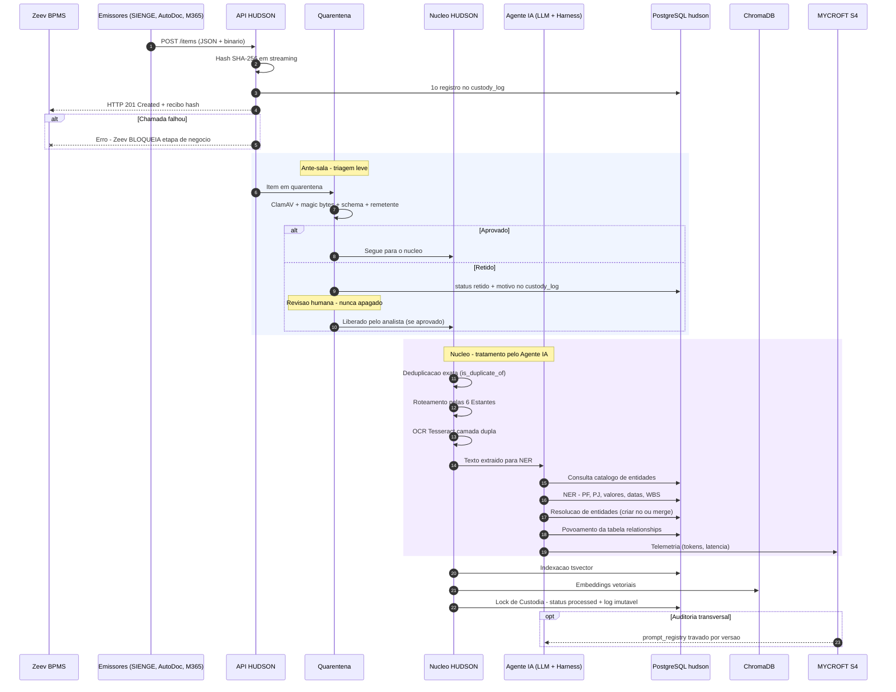
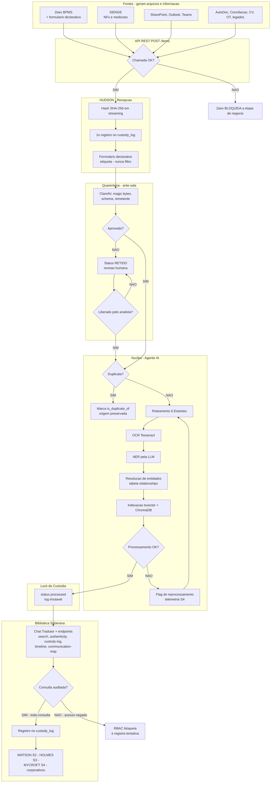

# HUDSON S1 — Arquitetura do Sistema

Custodiante forense e data warehouse do ecossistema (HUDSON S1, WATSON S2, HOLMES S3, MYCROFT S4). Hash SHA-256 em streaming e `custody_log` append-only garantem a cadeia de custódia de tudo que entra no acervo.

Este repositório reúne os três diagramas de arquitetura do desenho inicial do fluxo do sistema, em Mermaid.

## ⚠️ Nota técnica sobre o Bloco 1 (C4)

O suporte a `C4Context` no Mermaid é experimental e varia entre versões de renderizador. Testado neste ambiente (mermaid-cli 11.14.0): a diretiva `SHOW_LEGEND()` no fim do bloco quebra o parser com "Lexical error" — o restante do diagrama renderiza normalmente sem essa linha. O arquivo abaixo mantém `SHOW_LEGEND()` porque pode funcionar em outros renderizadores (ex.: mermaid.live com versão mais nova, ou o preview nativo do GitHub); se o C4 não renderizar no seu visualizador, remova essa linha ou use o Bloco 3 (Flowchart), validado e 100% estável.

## Diagramas

### 1. C4 Model — Contexto (Nível 1)

`01-c4-contexto.mmd`

```mermaid
C4Context
  title C4 Nivel 1 - Contexto do Sistema HUDSON S1

  Person(corporativo, "Consumidor Corporativo", "Advogado, gestor, auditor, due diligence e setores")
  Person(analista, "Analista de Quarentena", "Revisa itens retidos - nunca apaga")
  Person(gov, "Gestor de Governanca S4", "Aprova versoes do System Prompt")

  System(hudson, "HUDSON S1", "Custodiante forense e data warehouse - hash SHA-256 e custody_log append-only")
  System(watson, "WATSON S2", "Auditoria do acervo")
  System(holmes, "HOLMES S3", "Sindicancia - somente leitura")
  System(mycroft, "MYCROFT S4", "Governanca de IA - telemetria e prompt_registry")

  System_Ext(zeev, "Zeev BPMS", "Orquestra tarefas e mantem travas de ingestao")
  System_Ext(sienge, "SIENGE", "ERP - NFs, ordens e medicoes")
  System_Ext(autodoc, "AutoDoc", "Pranchas de projeto e ARTs")
  System_Ext(bancaria, "Conciliacao Bancaria", "Comprovantes e extratos")
  System_Ext(m365, "Microsoft 365", "SharePoint, Outlook e Teams")
  System_Ext(legados, "Legados", "SMB/NFS e caixas pst e msg")

  Rel(sienge, hudson, "Envia PDFs e XMLs por evento de negocio", "Webhook POST /items")
  Rel(autodoc, hudson, "Envia pranchas e ARTs", "Webhook POST /items")
  Rel(bancaria, hudson, "Envia comprovantes apos liquidacao", "Webhook POST /items")
  Rel(zeev, hudson, "Envia arquivos e formulario declarativo - espera recibo", "POST /items - HTTP 201")
  Rel(m365, hudson, "Documentos, e-mails e mensagens", "Graph API - conector unico")
  Rel(legados, hudson, "Varredura passiva agendada", "Celery Workers read-only")
  Rel(corporativo, hudson, "Consulta o acervo", "Chat Tradutor e endpoints de leitura")
  Rel(analista, hudson, "Revisa itens retidos", "Fila de revisao humana")
  Rel(holmes, hudson, "Consome o banco para sindicancia", "APIs de leitura auditada")
  Rel(watson, hudson, "Reporta falha de indexacao ou entidade omitida", "s1_audit_findings")
  Rel(hudson, mycroft, "Registra tokens e latencia de LLM", "llmops_telemetry")
  Rel(gov, mycroft, "Aprova ou bloqueia versoes de prompt", "prompt_registry")

  SHOW_LEGEND()
```

### 2. Sequência — Ingestão e Processamento

`02-sequencia-ingestao.mmd` — validado (renderiza sem erros).



### 3. Flowchart — Arquitetura Completa (alternativa estável ao C4)

`03-flowchart-completo.mmd` — validado (renderiza sem erros).



## Princípios evidenciados no desenho

- **Cadeia de custódia desde a entrada**: hash SHA-256 em streaming e primeiro registro no `custody_log` acontecem antes de qualquer outra etapa.
- **Zeev como trava de negócio**: se a chamada à API HUDSON falhar, o Zeev bloqueia a etapa de negócio — não há caminho de contorno.
- **Quarentena nunca apaga**: itens retidos ficam para revisão humana; a liberação é decisão do analista, não automática.
- **Deduplicação preserva origem**: duplicatas exatas são marcadas (`is_duplicate_of`), nunca descartadas.
- **Toda consulta é auditada**: leitura pela Biblioteca Soberana passa por RBAC e gera registro no `custody_log`, com bloqueio e registro de tentativa em caso de acesso negado.
