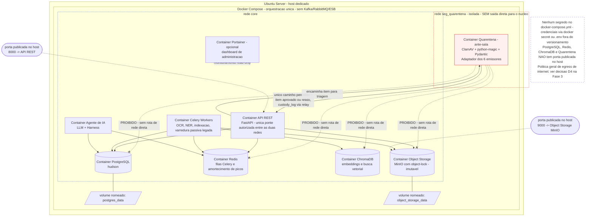

# P2 — Deployment / Camada Física (flowchart estável, equivalente a C4 Deployment)

```mermaid
%% P2 - Deployment / Camada Fisica do HUDSON S1
%% Implementado como flowchart (estavel) em vez de C4Deployment experimental,
%% seguindo a mesma convencao ja adotada em Claude-Biblioteca/03-flowchart-completo.mmd
flowchart TB

    subgraph HOST["Ubuntu Server - host dedicado"]
        direction TB

        subgraph COMPOSE["Docker Compose - orquestracao unica - sem Kafka/RabbitMQ/ESB"]
            direction TB

            subgraph NETQ["rede seg_quarentena - isolada - SEM saida direta para o nucleo"]
                direction TB
                QUAR["Container Quarentena - ante-sala<br/>ClamAV + python-magic + Pydantic<br/>Adaptador dos 6 emissores"]
            end

            subgraph NETCORE["rede core"]
                direction TB
                API["Container API REST<br/>FastAPI - unica ponte autorizada entre as duas redes"]
                PG[("Container PostgreSQL<br/>hudson")]
                REDIS[("Container Redis<br/>filas Celery e amortecimento de picos")]
                CHROMA[("Container ChromaDB<br/>embeddings e busca vetorial")]
                CELERY["Container Celery Workers<br/>OCR, NER, indexacao, varredura passiva legada"]
                STORAGE[("Container Object Storage<br/>MinIO com object-lock - imutavel")]
                AGENT["Container Agente de IA<br/>LLM + Harness"]
                PORTAINER["Container Portainer - opcional<br/>dashboard de administracao"]
            end

            VOLPG[/"volume nomeado: postgres_data"/]
            VOLSTORAGE[/"volume nomeado: object_storage_data"/]

            PG --- VOLPG
            STORAGE --- VOLSTORAGE
        end
    end

    QUAR -- "unico caminho permitido - item aprovado ou retido, custody_log via relay" --> API
    API -- "encaminha item para triagem" --> QUAR

    QUAR -. "PROIBIDO - sem rota de rede direta" .-x PG
    QUAR -. "PROIBIDO - sem rota de rede direta" .-x REDIS
    QUAR -. "PROIBIDO - sem rota de rede direta" .-x STORAGE
    QUAR -. "PROIBIDO - sem rota de rede direta" .-x CHROMA

    API --> PG
    API --> REDIS
    API --> STORAGE
    CELERY --> PG
    CELERY --> REDIS
    CELERY --> CHROMA
    CELERY --> STORAGE
    AGENT --> PG
    AGENT --> REDIS
    PORTAINER -. "monitoramento read-only" .-> COMPOSE

    EXTAPI(["porta publicada no host<br/>8000 -> API REST"])
    EXTMINIO(["porta publicada no host<br/>9000 -> Object Storage MinIO"])

    EXTAPI -.-> API
    EXTMINIO -.-> STORAGE

    NOTAS["Nenhum segredo no docker-compose.yml - credenciais via docker secret ou .env fora do versionamento<br/>PostgreSQL, Redis, ChromaDB e Quarentena NAO tem porta publicada no host<br/>Politica geral de egress de internet: ver decisao D4 na Fase 3"]

    style NOTAS fill:transparent,stroke-dasharray: 5 5
    style QUAR fill:#fff0f0,stroke:#cc0000
    style NETQ fill:transparent,stroke:#cc0000,stroke-dasharray: 3 3
    style NETCORE fill:transparent,stroke:#0044cc,stroke-dasharray: 3 3
```
