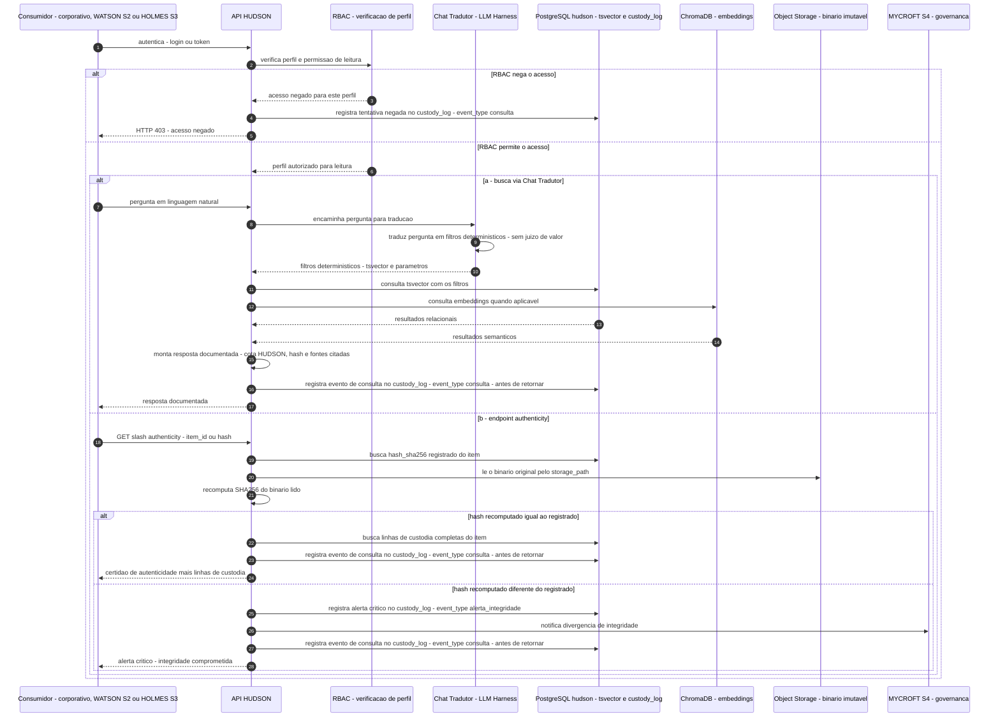

# P5 — Consumo (Chat Tradutor + /authenticity)

```mermaid
sequenceDiagram
    autonumber
    participant C as Consumidor - corporativo, WATSON S2 ou HOLMES S3
    participant API as API HUDSON
    participant RBAC as RBAC - verificacao de perfil
    participant LLM as Chat Tradutor - LLM Harness
    participant DB as PostgreSQL hudson - tsvector e custody_log
    participant VDB as ChromaDB - embeddings
    participant ST as Object Storage - binario imutavel
    participant S4 as MYCROFT S4 - governanca

    C->>API: autentica - login ou token
    API->>RBAC: verifica perfil e permissao de leitura

    alt RBAC nega o acesso
        RBAC-->>API: acesso negado para este perfil
        API->>DB: registra tentativa negada no custody_log - event_type consulta
        API-->>C: HTTP 403 - acesso negado
    else RBAC permite o acesso
        RBAC-->>API: perfil autorizado para leitura

        alt a - busca via Chat Tradutor
            C->>API: pergunta em linguagem natural
            API->>LLM: encaminha pergunta para traducao
            LLM->>LLM: traduz pergunta em filtros deterministicos - sem juizo de valor
            LLM-->>API: filtros deterministicos - tsvector e parametros
            API->>DB: consulta tsvector com os filtros
            API->>VDB: consulta embeddings quando aplicavel
            DB-->>API: resultados relacionais
            VDB-->>API: resultados semanticos
            API->>API: monta resposta documentada - cota HUDSON, hash e fontes citadas
            API->>DB: registra evento de consulta no custody_log - event_type consulta - antes de retornar
            API-->>C: resposta documentada
        else b - endpoint authenticity
            C->>API: GET slash authenticity - item_id ou hash
            API->>DB: busca hash_sha256 registrado do item
            API->>ST: le o binario original pelo storage_path
            API->>API: recomputa SHA256 do binario lido

            alt hash recomputado igual ao registrado
                API->>DB: busca linhas de custodia completas do item
                API->>DB: registra evento de consulta no custody_log - event_type consulta - antes de retornar
                API-->>C: certidao de autenticidade mais linhas de custodia
            else hash recomputado diferente do registrado
                API->>DB: registra alerta critico no custody_log - event_type alerta_integridade
                API->>S4: notifica divergencia de integridade
                API->>DB: registra evento de consulta no custody_log - event_type consulta - antes de retornar
                API-->>C: alerta critico - integridade comprometida
            end
        end
    end
```
