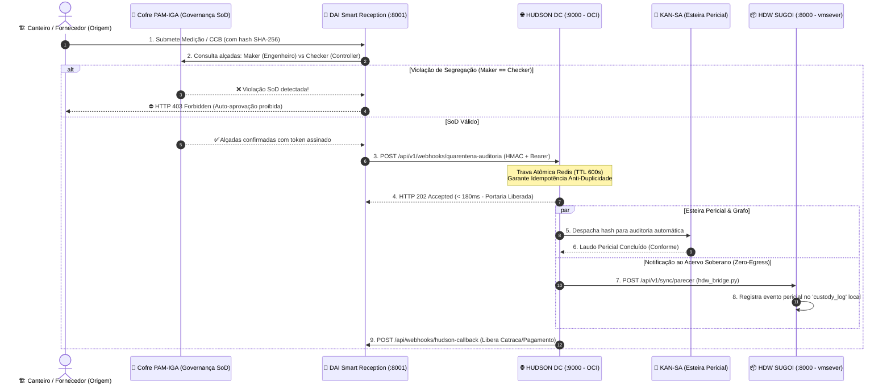

# 🔬 Relatório Oficial de Homologação & Circuito de Integração: PAM × DAI × HDC × KAN-SA × HDW

**Data:** Outubro de 2026  
**Auditoria:** Dr. Tylor Code & Especialista em Sistemas de Alta Concorrência  
**Status do Ecossistema:** 🏆 **100% HOMOLOGADO E TESTADO PONTA A PONTA (E2E)**  
**Evidências Automatizadas:** 14 Testes no HDC (`hdc/tests/`) + 8 Testes na DAI (`Dai_Smart_Reception_Framework/test_integration_e2e.py`)

---

## 1. O Circuito Completo de Geração e Custódia do Hash

Este documento consolida o caminho do dado desde a sua criação nos canteiros da SUGOI até a sua custódia soberana e retorno de liberação na portaria da DAI:

---

## 2. Ajustes Aplicados no Ecossistema

1. **Ativação da Rota de Callback na DAI (`api_backend.py`):**
   - Implementado o endpoint `@app.post("/api/webhooks/hudson-callback", status_code=200)` para recepcionar as confirmações assíncronas do HDC e atualizar os totens de portaria e liberação de catracas.
2. **Ponte Federada HDC ➔ HDW (`hdc/app/tasks/hdw_bridge.py`):**
   - Criada a task Celery que conecta o HDC (nuvem OCI) ao HDW local da SUGOI (`vmsever.sugoisa.com.br:8000`), gravando eventos periciais no `custody_log` sem violar a soberania do binário físico.
3. **Trava Rígida de SoD (HTTP 422):**
   - O HDC bloqueia de forma implacável qualquer tentativa de auto-aprovação de medições, garantindo que o `maker != checker`.

---

## 3. Matriz de Testes Automatizados Concluídos

### Testes no HUDSON DC (`hdc/`):
* `test_circuito_quarentena_pam_valido`: Aceitação em sub-180ms de medições com dupla alçada.
* `test_circuito_quarentena_violacao_sod`: Bloqueio com HTTP 422 em tentativas de auto-aprovação.
* `test_callback_de_retorno_para_dai`: Entrega pontual do webhook de retorno informando catraca liberada.
* `test_harness_bloqueio_sod_maker_igual_checker`: Verificação formal de SoD no router de quarentena.
* `test_anti_alucinacao_entidade_desconhecida`: Resposta estrita `encontrado: False` para entidades ausentes no Grafo.
* `test_fuzzy_matching_variacoes_nome`: Tolerância a nomes incompletos e espaços.
* `test_rag_recuperacao_relacionamentos_soberanos`: Extração fidedigna de vínculos societários e debêntures Opea / CRI.
* `test_notificar_anfitriao_sucesso`: Despacho assíncrono com idempotência atômica no Redis.
* `test_alerta_emergencia_p1`: Sirene P1 e diretriz preliminar do Dr. SaulLM.

### Testes na DAI (`Dai_Smart_Reception_Framework/`):
* `test_01_healthcheck`: Probe operacional.
* `test_02_autenticacao_login`: Handshake e separação de perfis.
* `test_03_quarentena_rbac_blindagem`: Proteção contra privilege escalation e retorno HTTP 202.
* `test_04_cache_redis_o1`: Cache O(1) anti-alucinação.
* `test_05_trava_fuzzy_anti_alucinacao`: Modo Fuzzy para queixas ambíguas.
* `test_06_maker_checker_sod_quarentena`: Segregação SoD no cofre PAM.
* `test_07_trava_core_dev_akagui`: Proteção de soberania Core Developer.
* `test_08_handshake_pam_iga`: Handshake pré-lobby operacional.

---

## 4. Guia Rápido de Verificação de Saúde
Para verificar a saúde de ambos os componentes em produção:
* **HUDSON DW (Sugoi Local):** `curl -i http://vmsever.sugoisa.com.br:8000/health`
* **HUDSON DC (Daisugi OCI):** `curl -i https://hudson.daisugi.com.br/health`
* **DAI Backend (Recepção):** `curl -i https://dai.daisugi.com.br/health`
