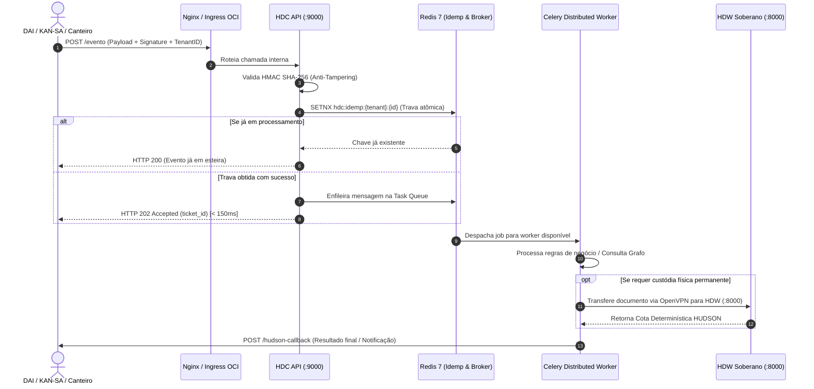

# ANÁLISE TÉCNICA E ARQUITETURAL: HUDSON DATA CENTER (HDC)
## IDENTIDADE, HUB ORQUESTRADOR MULTI-TENANT EM NUVEM, MENSAGERIA ASSÍNCRONA E GOVERNANÇA DE CONCORRÊNCIA

**Organização:** SUGOI S.A. & Daisugi Tecnologias  
**Módulo:** HUDSON Data Center (HUDSON PAI / Hub Central de Eventos)  
**Ambiente Operacional:** Oracle Cloud Infrastructure (OCI) — `hudson.daisugi.com.br`  
**Porta de Operação:** `:9000` (FastAPI / Uvicorn ASGI de Alta Concorrência)  
**Coordenação:** PMO de Processos, Riscos & Governança de TI  
**Liderança de Engenharia:** Dr. Taylor & Especialista em Sistemas Distribuídos e Concorrência  
**Especialidades Integradas:** Especialista em Processos & BPMN, Engenheiro Cloud OCI e Arquiteto de Software  
**Versão Homologada:** HDC v2.0 (Orquestração Multi-Tenant com Padrão Fire-and-Enqueue e Circuito PAM-IGA)  

---

## 🏛️ 1. O QUÊ? (Conceito, Identidade e Hub Orquestrador em Nuvem)

### 1.1. Definição do HUDSON DC (HDC)
O **HUDSON DC (HDC)** é o **Núcleo Orquestrador Central Multi-Tenant, Barramento de Mensageria e Hub de Eventos em Nuvem** da Daisugi Tecnologias, hospedado na infraestrutura escalável da **Oracle Cloud Infrastructure (OCI)** sob o domínio corporativo `hudson.daisugi.com.br`.

Diferente do **HDW (Hudson Data Warehouse)** — que é a biblioteca soberana local on-premises focada em custódia imutável e armazenamento físico pericial de arquivos —, o **HDC** é o **cérebro de alta concorrência, roteamento inteligente e homeostase operacional**. Ele conecta, desacopla e orquestra em tempo real as comunicações entre múltiplos agentes inteligentes, sistemas corporativos e data warehouses locais:

```
                            ECOSSISTEMA FEDERADO DAISUGI
   ┌─────────────────────────────────────────────────────────────────────────┐
   │                         HUDSON DC (HDC - PAI)                           │
   │               Oracle Cloud Infrastructure (OCI) - Porta :9000           │
   │           Hub de Mensageria, Idempotência, Grafo e Orquestração         │
   └───────────────┬─────────────────┬─────────────────┬─────────────────┬───┘
                   │                 │                 │                 │
                   ▼                 ▼                 ▼                 ▼
             ┌───────────┐     ┌───────────┐     ┌───────────┐     ┌───────────┐
             │    DAI    │     │   KAN-SA  │     │  PAM-IGA  │     │    HDW    │
             │ Portaria  │     │ Auditoria │     │ Dupla     │     │ Cofre DW  │
             │ Empática  │     │ Pericial  │     │ Alçada    │     │ Soberano  │
             │ (:8001)   │     │ de Obras  │     │ Maker-Chk │     │ (:8000)   │
             └───────────┘     └───────────┘     └───────────┘     └───────────┘
```

---

### 1.2. Mapeamento das Cargas e Eventos Gerenciados pelo HDC

O HDC é dimensionado para gerenciar fluxos massivos de requisições simultâneas sem bloqueio de I/O, operando nos seguintes pilares funcionais:

| Pilar de Mensageria | Tipo de Carga / Origem | Finalidade Operacional e Roteamento |
| :--- | :--- | :--- |
| **Atendimento e Portaria (DAI)** | Eventos disparados pela recepção inteligente (**DAI** - Smart Reception Framework via portas `:8001` / `:8501`), como chegada de visitantes, solicitações de acesso e entregas. | Notificação instantânea via Slack/Push ao anfitrião do departamento e checagem de perfil no Grafo de Entidades com latência inferior a 200 ms. |
| **Auditoria Pericial (KAN-SA)** | Encaminhamento de medições de obras, Cédulas de Crédito Bancário (CCBs), notas fiscais e contratos suspeitos. | Injeção imediata na esteira de auditoria automatizada do **KAN-SA**, gerando relatórios de divergência e alertas de quarentena. |
| **Governança de Acessos Privilegiados (PAM-IGA)** | Comandos administrativos críticos, reconfigurações de parâmetros de obras e autorizações de desembolso financeiro. | Aplicação de governança de dupla custódia (*Maker-Checker*), exigindo que uma segunda autoridade valide a transação antes da execução. |
| **Gestão de Alertas P1 e Emergência** | Detecção de sinistros, acidentes em canteiro, notificações judiciais urgentes ou invasões cibernéticas. | Disparo de sirene P1 corporativa para o PMO e convocação automática do **Dr. SaulLM** para emissão de diretrizes jurídicas preliminares. |
| **Federação e Despacho para HDWs** | Pacotes de arquivos e registros estruturados colhidos em múltiplos canteiros ou na nuvem. | Roteamento seguro através de VPN privada para o respectivo **HDW local (Filhote)** da empresa correspondente, para custódia física soberana. |

---

## ⚙️ 2. COMO? (Arquitetura de TI, Engenharia de Nuvem e Especificações Técnicas)

### 2.1. Topologia de Nuvem OCI e Padrão Fire-and-Enqueue

Para garantir tempos de resposta de milissegundos para a interface empática da DAI e sistemas de portaria, o HDC adota a arquitetura assíncrona **Fire and Enqueue**:

```
                                ARQUITETURA DO HDC (OCI)
   ┌─────────────────────────────────────────────────────────────────────────┐
   │                           INGRESS & SEGURANÇA                           │
   │      Nginx Reverse Proxy + Terminação TLS + WAF / Cloudflare OCI        │
   │    Validação HMAC SHA-256 (X-Daisugi-Signature) + Tenant Segregation    │
   └────────────────────────────────────┬────────────────────────────────────┘
                                        │
                                        ▼
   ┌─────────────────────────────────────────────────────────────────────────┐
   │                       API GATEWAY FASTAPI (:9000)                       │
   │  Trava Atômica de Idempotência: SET hdc:idemp:{tenant}:{id} PROCESSING  │
   │                     Resposta Rápida: HTTP 202 Accepted                  │
   └──────────────────┬───────────────────────────────────┬──────────────────┘
                      │                                   │
                      ▼                                   ▼
   ┌─────────────────────────────────────┐  ┌────────────────────────────────┐
   │      REDIS 7 (BROKER & CACHE)       │  │    GRAFO DE ENTIDADES (OCI)    │
   │ - Fila de Mensagens / PubSub        │  │ - Relações Societárias e Obras │
   │ - Trava de Idempotência com TTL     │  │ - Cargos, Alçadas e Permissões │
   └──────────────────┬──────────────────┘  └────────────────┬───────────────┘
                      │                                      │
                      ▼                                      ▼
   ┌─────────────────────────────────────────────────────────────────────────┐
   │                       CELERY DISTRIBUTED WORKERS                        │
   │ - Processamento pesado em background                                    │
   │ - Integração com KAN-SA / Dr. SaulLM                                    │
   │ - Despacho via OpenVPN para HDW On-Premises                             │
   └────────────────────────────────────┬────────────────────────────────────┘
                                        │
                                        ▼
   ┌─────────────────────────────────────────────────────────────────────────┐
   │                       WEBHOOK HUDSON-CALLBACK                           │
   │  Retorno assíncrono para o cliente de origem (DAI, Kan-sa, Operador)   │
   └─────────────────────────────────────────────────────────────────────────┘
```

---

### 2.2. Tecnologias e Mecanismos do HDC

1. **API Gateway Assíncrono (FastAPI / Uvicorn na Porta `:9000`):**
   * Ponto único de entrada para chamadas HTTP REST e Webhooks.
   * Não executa tarefas pesadas em tempo de requisição; apenas valida a mensagem, enfileira o evento e responde `HTTP 202 Accepted` em < 150 ms.
2. **Idempotência Criptográfica e Trava no Redis:**
   * Previne que cliques duplos, instabilidades de rede ou reenvios automáticos gerem eventos duplicados.
   * Aplica trava atômica antes do processamento:
     ```python
     # Trava de Idempotência Atômica no Redis
     lock_key = f"hdc:idemp:{tenant_id}:{ticket_id}"
     if not redis_client.set(lock_key, "PROCESSING", nx=True, ex=600):
         return {"status": "already_queued", "ticket_id": ticket_id}
     ```
3. **Mecanismo Anti-Tampering (Assinatura HMAC SHA-256):**
   * Toda mensagem enviada ao HDC deve conter o cabeçalho `X-Daisugi-Signature`.
   * O HDC recalcula a assinatura com base no segredo compartilhado do tenant e descarta imediatamente requisições que sofreram adulteração em trânsito.
4. **Isolamento Estrito Multi-Tenant (`X-Daisugi-Tenant-ID`):**
   * Segregação lógica de filas, chaves de cache e consultas no banco de dados. Os dados de um tenant (ex: SUGOI) jamais se misturam com os de outro parceiro no barramento.
5. **Grafo Corporativo de Entidades (Knowledge Graph):**
   * Mapeamento semântico de relações entre pessoas, empresas parceiras, empreiteiros, canteiros de obra (WBS) e alçadas de autorização, permitindo enriquecimento de contexto para agentes de IA.
6. **Integração com Cofre PAM-IGA (Governança Maker-Checker):**
   * Qualquer alteração de dados sensíveis ou ordem de pagamento requer dupla alçada: o primeiro usuário agenda a alteração (*Maker*) e uma autoridade designada aprova (*Checker*).

---

### 2.3. Matriz de Endpoints do HDC

| Método & Rota | Cabeçalhos Mandatórios | Descrição Funcional | Resposta |
| :--- | :--- | :--- | :--- |
| `POST /api/v1/eventos/notificar-anfitriao` | `X-Daisugi-Tenant-ID`<br>`X-Daisugi-Signature` | Notifica o anfitrião interno sobre a chegada de visitante ou entrega registrada pela DAI. | `202 Accepted`<br>`{"ticket_id": "...", "status": "queued"}` |
| `POST /api/v1/webhooks/quarentena-auditoria` | `X-Daisugi-Tenant-ID`<br>`X-Daisugi-Signature` | Encaminha documentos, medições e contratos suspeitos para quarentena pericial no KAN-SA. | `202 Accepted`<br>`{"quarentena_id": "...", "status": "triagem"}` |
| `POST /api/v1/alertas/emergencia` | `X-Daisugi-Tenant-ID`<br>`X-Daisugi-Signature` | Aciona sirene de emergência P1 corporativa e consulta preliminar de apoio com Dr. SaulLM. | `200 OK`<br>`{"alerta_id": "...", "sirene": "disparada"}` |
| `GET /api/v1/grafo/consultar-entidade` | `X-Daisugi-Tenant-ID`<br>`X-API-Key` | Consulta o perfil corporativo, riscos e alçadas de uma pessoa ou fornecedor no Grafo de Entidades. | `200 OK`<br>`{"entidade": "...", "alçadas": [...]}` |
| `POST /api/webhooks/hudson-callback` | `X-Daisugi-Tenant-ID`<br>`X-Daisugi-Signature` | Webhook de retorno assíncrono emitido pelo HDC para atualizar o status do evento na DAI ou KAN-SA. | `200 OK`<br>`{"status": "entregue"}` |

---

### 2.4. Ciclo de Vida do Evento no HDC (Workflow BPMN do Fire-and-Enqueue)



---

## 🎯 3. PORQUÊ? (Dores Resolvidas, Propósito Empresarial e Atendimento de Alta Concorrência)

### 3.1. Matriz de Dores Organizacionais: Cenário Anterior vs. HUDSON DC

```
                     DESACOPLAMENTO ELÁSTICO E HOMEOSTASE
   ┌───────────────────────────────────┐       ┌───────────────────────────────────┐
   │       ANTES (CONGESTÃO & RISCO)   │  ──►  │       COM HDC (ELASTICIDADE)      │
   ├───────────────────────────────────┤       ├───────────────────────────────────┤
   │ • Portaria DAI travando em picos  │       │ • Resposta HTTP 202 em < 150 ms   │
   │ • Requisições duplicadas na rede  │       │ • Trava de idempotência no Redis  │
   │ • Servidor on-premises sobrecarreg│       │ • HDW protegido atrás do HDC      │
   │ • Riscos de adulteração de pacote │       │ • Assinatura HMAC SHA-256         │
   │ • Mistura de dados entre empresas │       │ • Multi-tenancy rigorosamente segre│
   └───────────────────────────────────┘       └───────────────────────────────────┘
```

| Desafio de Concorrência & TI | Sem o HDC (Gargalo Direto) | Com o HUDSON DC (Hub Orquestrador) |
| :--- | :--- | :--- |
| **Latência na Recepção e Portaria (DAI)** | Se a DAI tentasse enviar contratos pesados ou consultar o banco diretamente no canteiro, a portaria ficava travada em telas de "carregando", gerando filas de espera físicas no balcão. | **Desacoplamento Assíncrono:** A DAI recebe `HTTP 202 Accepted` em fração de segundo. O visitante é liberado imediatamente enquanto o HDC processa a carga em segundo plano. |
| **Impacto de Picos de Acesso no Servidor Local** | Se 50 canteiros tentassem subir relatórios simultaneamente no servidor Linux local (`192.168.1.122`), a CPU e o disco entrariam em saturação (*Denial of Service acidental*). | **Buffer Elástico em Nuvem:** O HDC absorve os picos de tráfego na nuvem OCI e descarrega os pacotes no HDW local de forma cadenciada e segura através da VPN. |
| **Segurança e Proteção de Perímetro** | Expor o servidor do HDW diretamente na internet com IP público abriria vetor crítico para ataques de ransomware e invasão hacker no acervo forense. | **Blindagem de Acesso:** O HDW não possui IP público. Apenas o HDC (em nuvem protegida) comunica-se com o HDW através de túnel criptografado OpenVPN. |
| **Resiliência e Quedas de Conexão** | Se a internet do canteiro ou do escritório local oscilasse, a transação seria perdida e o operador precisaria recomeçar todo o envio do documento. | **Persistência Temporária e Retry:** O HDC retém a mensagem na fila do Celery com política de retentativas exponenciais (*exponential backoff*) até a reconexão. |

---

### 3.2. Níveis de Serviço (SLA / SLO) do HDC

* **Tempo de Resposta do Ingress (Fire-and-Enqueue):** **< 150 ms** para 99% das requisições (p99).
* **Disponibilidade da Nuvem (Uptime OCI):** **99.99%** com balanceamento e redundância geográfica.
* **Tolerância a Duplicidade:** **100% de prevenção** via chaves de idempotência atômica com TTL configurável.
* **Capacidade de Concorrência:** Dimensionado para sustentar **mais de 5.000 eventos simultâneos por minuto** sem degradação da interface gráfica da DAI.

---

### 3.3. Quem o HDC Atende? (Mapeamento de Stakeholders)

1. **Equipe de Portaria e Recepção (Usuários da DAI):**
   * Proporciona uma interface ágil, fluida e instantânea no atendimento diário a visitantes, engenheiros e fornecedores nos escritórios e canteiros.
2. **Peritos e Auditores Financeiros (Usuários do KAN-SA):**
   * Garante uma esteira automatizada para envio assíncrono de grandes volumes de contratos e notas fiscais para triagem e quarentena pericial.
3. **Gestores de TI e Administradores de Segurança:**
   * Centraliza a governança de chaves, tokens, assinaturas HMAC e auditoria de acessos privilegiados (*PAM-IGA Maker-Checker*).
4. **Data Warehouses Soberanos Federados (HDWs):**
   * Protege as bibliotecas locais contra sobrecargas externas, entregando dados limpos, assinados e descompactados para a custódia pericial definitiva.

---

## 4. 📝 CONCLUSÃO DO PMO E CERTIFICAÇÃO DE IDENTIDADE

O **HUDSON DC (HDC)** é a engrenagem de **alta concorrência, inteligência de mensageria e desacoplamento elástico** do ecossistema Daisugi / SUGOI. Ao combinar validação anti-tampering por HMAC, idempotência em Redis, padrão assíncrono Fire-and-Enqueue e integração nativa com o **HDW Soberano**, o HDC assegura que a governança de processos corporativos atinja máxima agilidade na ponta (DAI) com absoluta blindagem e segurança no cofre central (HDW).
