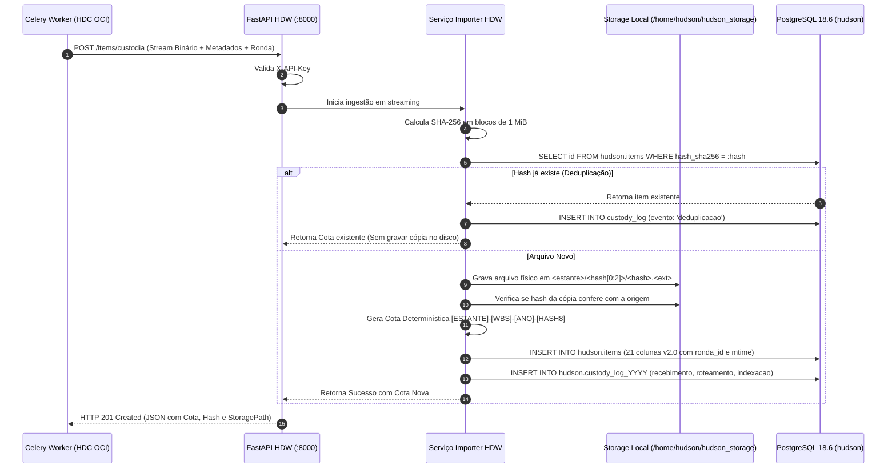

# ESPECIFICAÇÃO DE CUSTÓDIA SOBERANA & TUNELAMENTO: HDC ⇄ HDW
## PROTOCOLO DE DESPACHO SEGURO, CADEIA DE CUSTÓDIA FORENSE E IMUTABILIDADE POSTGRESQL 18.6

**Organização:** SUGOI S.A. & Daisugi Tecnologias  
**Sistemas Integrados:** HUDSON Data Center (HDC / Nuvem OCI) & HUDSON Data Warehouse (HDW / Linux Local)  
**Coordenação:** PMO de Processos, Riscos & Governança de TI  
**Liderança Técnica:** Dr. Taylor (Especialista em DW & Arquitetura de Dados) & Perito em Auditoria Forense  
**Ambiente Alvo:** Servidor Linux CentOS 7 (`192.168.1.122:8000`) — Sub-rede Local Privada  
**Data de Emissão:** 09 de Outubro de 2026  
**Status do Documento:** 🟢 **HOMOLOGADO PARA PRODUÇÃO (CONTRATO DE INTERFACE V2.0)**  

---

## 🏛️ 1. VISÃO GERAL E FRONTEIRA DE SEGURANÇA

A integração entre o **HDC (Oracle Cloud OCI)** e o **HDW (Linux Local On-Premises)** representa a espinha dorsal da soberania de dados da SUGOI S.A..

O princípio fundamental desta arquitetura é a **Segregação Estrita de Responsabilidades**:
* O **HDC** atua como o **ÚNICO cliente autorizado** a se comunicar com o HDW através do túnel seguro OpenVPN;
* O **HDW** é o **Cofre Digital Soberano**, responsável exclusivamente por:
  1. Validar a integridade criptográfica do binário via SHA-256;
  2. Impedir a duplicação física de arquivos repetidos;
  3. Gerar a **Cota HUDSON Determinística**;
  4. Gravar o arquivo físico em disco de forma definitiva (*Zero Exclusão de Binários*);
  5. Registrar os eventos de custódia na tabela particionada `custody_log`, protegida por gatilhos em PL/pgSQL que abortam qualquer tentativa de alteração ou exclusão.

---

## 🔒 2. TUNELAMENTO SEGURO & AUTENTICAÇÃO MESTRE

```
                            CONEXÃO CRIPTOGRAFADA HDC ⇄ HDW
   ┌──────────────────────────────────────────────┐
   │         NUVEM ORACLE (OCI PRIVADA)           │
   │       Celery Worker / HDC Core Gateway       │
   └──────────────────────┬───────────────────────┘
                          │
                          │ Túnel Dedicado OpenVPN (UDP Porta 1194)
                          │ Criptografia AES-256-CBC + SHA256 Handshake
                          │ Restrito à sub-rede 192.168.1.0/24
                          ▼
   ┌──────────────────────────────────────────────┐
   │        SERVIDOR LINUX CENTOS 7 (SUGOI)       │
   │  FastAPI Interno (:8000) + PostgreSQL 18.6  │
   │  Cabeçalho Mandatório: X-API-Key Secreta     │
   └──────────────────────────────────────────────┘
```

### 2.1. Regras de Perímetro e Autenticação
* **Zero Exposição Pública:** O servidor Linux (`192.168.1.122`) não possui IP público e descarta automaticamente qualquer pacote que não seja originado da interface virtual `tun0` da OpenVPN.
* **Autenticação por Chave de Serviço:** Toda requisição do HDC para o HDW deve injetar no cabeçalho HTTP:
  ```http
  X-API-Key: CYkaMs6qsJFDCJmYG49gKXXNFOSGJRBs3OizqZuXK3A
  ```
* Qualquer requisição sem a chave ou com chave incorreta é sumariamente rejeitada com `HTTP 401 Unauthorized` e registrada como evento de segurança.

---

## ⚙️ 3. O CICLO DE VIDA DA CUSTÓDIA FORENSE NO HDW

Quando um pacote de arquivo despachado pelo HDC chega ao endpoint do HDW, o seguinte fluxo transacional atômico é executado:



---

## 🛡️ 4. BLINDAGEM JURÍDICA: TRIGGERS DE IMUTABILIDADE POSTGRESQL

A validade pericial do HDW reside na impossibilidade matemática e sistêmica de alteração de seus dados históricos. No banco **PostgreSQL 18.6 (schema `hudson`)**, os seguintes gatilhos atuam ativamente:

### 4.1. Bloqueio em `hudson.custody_log` (e Partições Anuais)
```sql
CREATE OR REPLACE FUNCTION hudson.bloquear_update_delete_custody_log()
RETURNS trigger AS $$
BEGIN
    RAISE EXCEPTION 'VIOLAÇÃO DE CUSTÓDIA: Registros de custódia no HDW são 100%% imutáveis e não podem ser alterados ou deletados.';
END;
$$ LANGUAGE plpgsql;

-- Gatilhos aplicados na tabela mãe e em cada partição anual
CREATE TRIGGER custody_log_bloqueia_update_delete
BEFORE UPDATE OR DELETE ON hudson.custody_log
FOR EACH ROW EXECUTE FUNCTION hudson.bloquear_update_delete_custody_log();
```

### 4.2. Bloqueio de Deleção em `hudson.items`
```sql
CREATE OR REPLACE FUNCTION hudson.bloquear_delete_items()
RETURNS trigger AS $$
BEGIN
    RAISE EXCEPTION 'VIOLAÇÃO DE ACERVO: Nenhum item custodiado no HDW pode ser deletado do banco de dados.';
END;
$$ LANGUAGE plpgsql;

CREATE TRIGGER items_bloqueia_delete
BEFORE DELETE ON hudson.items
FOR EACH ROW EXECUTE FUNCTION hudson.bloquear_delete_items();
```

---

## 🔍 5. A ROTA DE PERÍCIA FORENSE EM TEMPO REAL: `GET /items/{cota}/authenticity`

Para comprovação incontestável em disputas judiciais cíveis, fiscais ou trabalhistas, o HDW expõe uma rota pericial que realiza a verificação física direta no disco:

### 5.1. Comportamento do Endpoint
1. O perito ou sistema solicita: `GET /items/{cota}/authenticity`;
2. O HDW localiza o caminho físico gravado em `items.storage_path`;
3. O servidor abre o arquivo real no disco `/home/hudson/hudson_storage/...` e **recalcula o hash SHA-256 bit a bit em tempo real**;
4. O hash recalculado é confrontado com:
   * O hash original armazenado na tabela `items.hash_sha256`;
   * O payload gravado no primeiro evento de custódia na tabela `custody_log`.
5. Se os três valores forem idênticos, a API emite o **Atestado Pericial Criptográfico**:

```json
{
  "cota": "document_text-OBRA-FLORES-2026-2026-464468e2",
  "status_integridade": "100%_INTEGRO",
  "hash_calculado_agora": "464468e27158f894987e82c35dcdda08fe0b3fb647cb9ab8d4ccceebc6067a59",
  "hash_custodia_original": "464468e27158f894987e82c35dcdda08fe0b3fb647cb9ab8d4ccceebc6067a59",
  "tamanho_bytes": 1048576,
  "data_primeira_custodia_utc": "2026-10-08T22:01:13.396Z",
  "conclusao_pericial": "O arquivo físico em disco confere de forma exata e matematicamente incontestável com a cadeia de custódia imutável registrada na data do fato."
}
```

---

## 💾 6. PRESERVAÇÃO DE RECURSOS NO SERVIDOR LINUX DA SUGOI

Nossa auditoria confirmou que o disco do servidor Linux (`/dev/sda3`) possui apenas **3,2 GB livres (69% de ocupação)**. Esta integração protege a máquina através de 3 diretrizes:
1. **Deduplicação Física:** O mesmo arquivo (ex: minuta de contrato enviada 10 vezes) é armazenado uma única vez no disco;
2. **Compressão e Streaming:** O HDC envia arquivos comprimidos em streaming contínuo, sem gravar arquivos temporários que inflam a pasta `/tmp`;
3. **Isolamento de Carga:** Zero conexões diretas de operadores humanos no PostgreSQL local, mantendo a CPU e a memória do servidor 100% disponíveis para a integridade dos dados.
