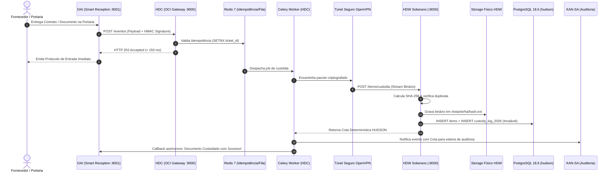
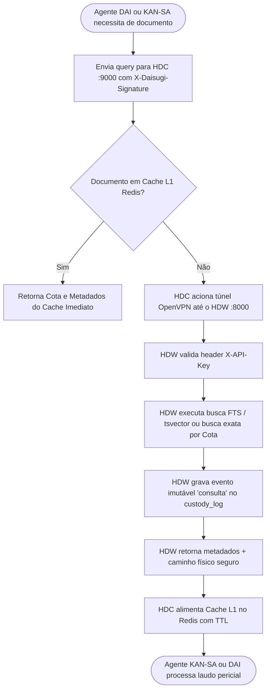
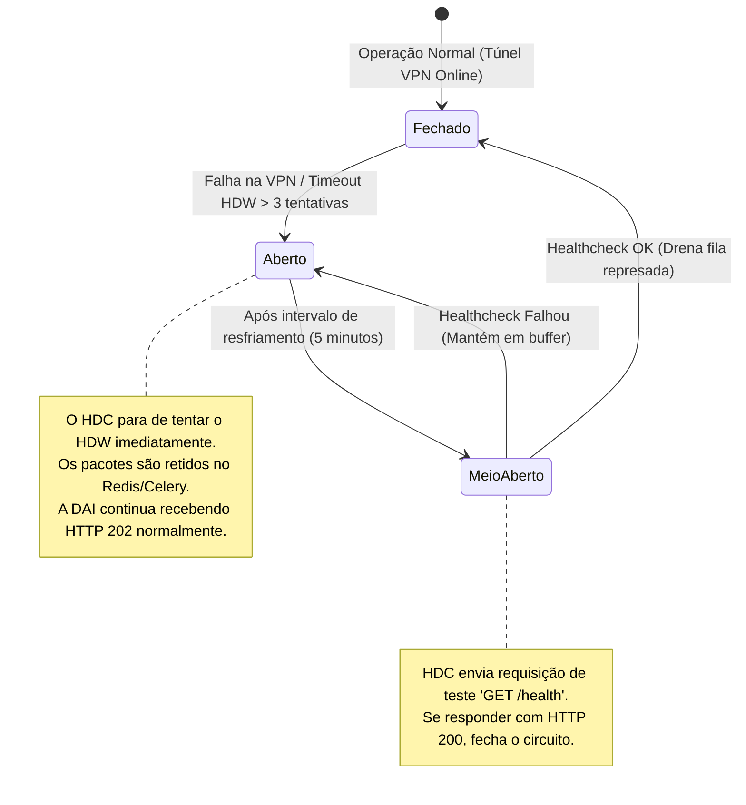

# MANUAL DE INTEGRAÇÃO INTEGRADA, WORKFLOWS E GOVERNANÇA: HDW ⇄ HDC
## ARQUITETURA DE INTERFACE, PROTOCOLOS DE COMUNICAÇÃO, FLUXOGRAMAS BPMN E MATRIZ RACI CORPORATIVA

**Organização:** SUGOI S.A. & Daisugi Tecnologias  
**Sistemas:** HUDSON Data Warehouse (HDW) & HUDSON Data Center (HDC)  
**Coordenação Geral:** PMO de Processos, Riscos & Governança de TI  
**Liderança de Engenharia:** Dr. Taylor (Especialista em DW) & Equipe de Arquitetura de Nuvem e Sistemas Distribuídos  
**Data de Emissão:** 09 de Outubro de 2026  
**Status Normativo:** 🟢 **DOCUMENTO HOMOLOGADO DE INTERFACE E GOVERNANÇA**  

---

## 🏛️ 1. INTRODUÇÃO E MODELO CONCEITUAL INTEGRADO

O ecossistema de inteligência documental e arquivologia forense da SUGOI S.A. opera através da simbiose entre dois módulos complementares que atuam em zonas de rede distintas:

```
                            TOPOLOGIA FEDERADA HDC ⇄ HDW
   ┌──────────────────────────────────────────────┐
   │             NUVEM ORACLE (OCI)               │
   │            HUDSON DC (HDC - PAI)             │
   │  • Orquestrador Multi-Tenant (Porta :9000)   │
   │  • Padrão Fire-and-Enqueue (Redis 7/Celery)  │
   │  • Buffer Elástico e Grafo de Entidades      │
   └──────────────────────┬───────────────────────┘
                          │
                          │ Túnel Seguro OpenVPN (AES-256-CBC)
                          │ Autenticação Mútua mTLS / X-API-Key
                          ▼
   ┌──────────────────────────────────────────────┐
   │         REDE PRIVADA LOCAL (ON-PREMISES)     │
   │            HUDSON DW (HDW - COFRE)           │
   │  • Servidor Linux CentOS 7 (Porta :8000)     │
   │  • PostgreSQL 18.6 Imutável (schema hudson)  │
   │  • Storage Físico Criptográfico (Hash SHA256)│
   └──────────────────────────────────────────────┘
```

### 1.1. Princípio da Bipolaridade Estrutural
1. **O HUDSON DC (HDC) é o "Célebro de Nuvem":** Voltado para alta concorrência, absorção elástica de eventos, triagem de mensageria da portaria (**DAI**), distribuição para auditoria (**KAN-SA**) e prevenção de sobrecarga dos servidores locais.
2. **O HUDSON DW (HDW) é o "Cofre Soberano On-Premises":** Voltado para custódia estrita, persistência imutável de binários no sistema de arquivos local, indexação profunda (*tsvector*, RapidFuzz, embeddings) e blindagem contra adulteração ou exclusão via gatilhos de banco de dados.

---

## ⚙️ 2. ARQUITETURA TÉCNICA DE INTERFACE E PROTOCOLOS DE COMUNICAÇÃO

### 2.1. Matriz de Conectividade e Portas

| Origem | Destino | Protocolo / Canal | Porta | Autenticação / Segurança | Finalidade |
| :--- | :--- | :--- | :--- | :--- | :--- |
| **Clientes (DAI / KAN-SA)** | **HDC (OCI)** | HTTPS / REST | `443` ➔ `:9000` | TLS 1.3 + `X-Daisugi-Signature` (HMAC SHA-256) + `X-Daisugi-Tenant-ID` | Envio de eventos, requisições de triagem e notificações. |
| **HDC (OCI)** | **HDW (Linux Local)** | Túnel OpenVPN (UDP) | `1194` ➔ `:8000` | Criptografia AES-256-CBC + `X-API-Key` no cabeçalho HTTP | Despacho de pacotes documentais para custódia e consultas por cota/busca. |
| **HDW (Linux Local)** | **HDC (OCI)** | HTTPS / Webhook | `443` ➔ `:9000` | TLS 1.3 + `X-Daisugi-Signature` + Ticket ID | Callback assíncrono informando conclusão de custódia e emissão de cota. |
| **Clientes Internos** | **HDW (Linux Local)** | OpenVPN Dedicado | `1194` ➔ `:8000` | Perfil `hudson_vpn.ovpn` + `X-API-Key` | Varredura e ingestão via CLI local (`import_cli.py`). |

---

### 2.2. Mecanismos de Autenticação e Schemas de Intercâmbio

#### A. Despacho de Documento para Custódia (HDC ➔ HDW)
O worker Celery do HDC abre conexão segura pelo túnel OpenVPN e envia o pacote para o endpoint do HDW:

```http
POST /api/v1/custodia/despachar HTTP/1.1
Host: 192.168.1.122:8000
X-API-Key: CYkaMs6qsJFDCJmYG49gKXXNFOSGJRBs3OizqZuXK3A
Content-Type: application/json

{
  "ticket_id": "TCK-SUGOI-20261009-8841",
  "obra_wbs": "OBRA-FLORES-2026",
  "ronda_id": "RONDA-OCI-2026-10-09-01",
  "usuario_captura": "operador_portaria_dai",
  "maquina_origem": "srv-oci-hdc-worker01",
  "nome_arquivo_original": "Contrato_Empreiteira_Alvenaria_V02.pdf",
  "payload_base64": "JVBERi0xLjQKJcTl8uXr...",
  "metadados_adicionais": {
    "departamento": "Engenharia",
    "fornecedor_cnpj": "12.345.678/0001-90"
  }
}
```

#### B. Resposta de Homologação de Custódia (HDW ➔ HDC)
Após a verificação de hash SHA-256 em streaming, deduplicação, gravação física no disco e inserção no `custody_log`, o HDW retorna:

```http
HTTP/1.1 201 Created
Content-Type: application/json

{
  "status": "custodiado",
  "cota": "document_text-OBRA-FLORES-2026-2026-464468e2",
  "hash_sha256": "464468e27158f894987e82c35dcdda08fe0b3fb647cb9ab8d4ccceebc6067a59",
  "estante": "document_text",
  "storage_path": "/home/hudson/hudson_storage/document_text/46/464468e2...pdf",
  "timestamp_custodia": "2026-10-09T11:28:40.124Z",
  "eventos_gerados": ["recebimento", "roteamento", "indexacao"]
}
```

---

## 📊 3. DESENHO DOS FLUXOGRAMAS E WORKFLOWS INTEGRADOS

### 3.1. Workflow Completo: Da Ingestão na Recepção (DAI) à Custódia Forense (HDW)



---

### 3.2. Workflow de Consulta Semântica e Perícia (KAN-SA / DAI ➔ HDW)



---

### 3.3. Workflow de Contingência e Circuit Breaker (Tolerância a Falhas)



---

## 📋 4. MATRIZ RACI CORPORATIVA: GOVERNANÇA INTEGRADA HDW ⇄ HDC

A Matriz RACI estabelece a governança formal entre as áreas de negócio, tecnologia e compliance:
* **R (Responsible):** Quem executa a atividade operacional.
* **A (Accountable):** A autoridade final que aprova e responde pelo resultado perante a Diretoria.
* **C (Consulted):** O especialista técnico consultado para subsidiar a decisão.
* **I (Informed):** A parte informada sobre o andamento e conclusão do processo.

### 4.1. Mapeamento de Papéis Integrados

1. **ENG:** Engenheiro de Obra / Gestor de Contratos da SUGOI
2. **OP-CAP:** Operador de Captura / Ronda de Digitalização (Canteiro ou Escritório)
3. **PMO:** PMO de Processos, Riscos & Governança de TI
4. **DR-TAYLOR:** Dr. Taylor (Especialista em DW, HDW & Engenharia de Dados)
5. **ARQ-CLOUD:** Arquiteto de Nuvem OCI (HDC & Mensageria de Alta Concorrência)
6. **JUR-COMP:** Departamento Jurídico, DPO & Compliance da SUGOI S.A.
7. **IA-AGENTS:** Agentes Autônomos de Inteligência Artificial (DAI, KAN-SA, Dr. SaulLM)

---

### 4.2. Matriz RACI por Etapas do Ciclo de Vida Documental

| Atividade / Etapa do Processo | ENG | OP-CAP | PMO | DR-TAYLOR | ARQ-CLOUD | JUR-COMP | IA-AGENTS |
| :--- | :---: | :---: | :---: | :---: | :---: | :---: | :---: |
| **1. Definição e Cadastro de WBS de Obras (`obra_wbs`)** | **A / R** | I | **C** | **C** | I | I | I |
| **2. Recepção Física e Entrada de Documentos na DAI** | I | **R** | I | I | **C** | I | **A / R** *(DAI)* |
| **3. Validação de Assinatura HMAC e Idempotência (HDC)** | I | I | I | I | **A / R** | I | **C** |
| **4. Varredura Local de Arquivos via CLI (`--ronda`)** | **C** | **R** | **C** | **A** | I | I | I |
| **5. Deduplicação e Desbloqueio Forense (*HudsonDesbloqueador*)** | I | I | I | **A / R** | I | I | **C** |
| **6. Geração da Cota Determinística HUDSON** | I | I | I | **A / R** | **C** | I | I |
| **7. Gravação Física no Storage Local (`STORAGE_ROOT`)** | I | I | I | **A / R** | I | I | I |
| **8. Inserção Imutável no Banco (`items` e `custody_log`)** | I | I | **C** | **A / R** | I | **C** | I |
| **9. Indexação Textual (`tsvector`) e Vetorial (ChromaDB)** | I | I | I | **A / R** | I | I | **C** |
| **10. Notificação e Triagem Pericial no KAN-SA** | I | I | I | **C** | **C** | I | **A / R** *(KAN-SA)* |
| **11. Emissão de Certidão Forense de Autenticidade (`/authenticity`)** | **C** | I | **A** | **R** | I | **A** | **C** |
| **12. Monitoramento de Uptime e Circuit Breaker (HDC ⇄ HDW)** | I | I | **C** | **R** | **A / R** | I | I |
| **13. Gestão de Dupla Custódia e Alçadas (Cofre PAM-IGA)** | I | I | **A** | **C** | **R** | **A** | I |
| **14. Execução de Backups Físicos e Disaster Recovery (RTO/RPO)** | I | I | **A** | **R** | **C** | I | I |
| **15. Auditorias Externas de Conformidade (PBQP-H / ISO 9001 / CEF)** | **R** | I | **A** | **C** | I | **A** | **C** |

---

## 🛡️ 5. POLÍTICAS DE RESILIÊNCIA, CIRCUIT BREAKER E GOVERNANÇA

### 5.1. Padrão Circuit Breaker e Buffer de Contingência
1. **Saturação de Rede ou Queda da VPN:**  
   Caso o túnel OpenVPN fique indisponível entre a nuvem OCI e o servidor Linux local (`192.168.1.122`), o HDC entra no estado **Circuit Open**:
   * O HDC retém todas as cargas recebidas no **Redis persistente**;
   * A interface da **DAI** continua operando sem erros, garantindo atendimento contínuo na portaria com resposta imediata;
   * O HDC executa retentativas com recuo exponencial (*exponential backoff*) por até **72 horas** sem perda de nenhum byte;
   * Quando o túnel é restabelecido, o HDC drena a fila de forma cadenciada, descarregando os arquivos no HDW sem provocar sobrecarga de CPU ou I/O de disco.
2. **Dead Letter Queue (DLQ):**  
   Arquivos corrompidos que falhem na extração de hash ou que contenham payloads inválidos são isolados em uma fila de quarentena especial (`hdc:dlq:corrompidos`), gerando alerta P2 no painel do PMO para análise manual.

### 5.2. Governança e Conformidade Regulatória (LGPD & Forense)
* **Princípio da Menor Exposição (Zero Public Exposure):** O HDW não possui endereço IP público e não responde a comandos fora da rede VPN autorizada.
* **Auditabilidade e Não-Repúdio:** Todo evento de leitura, busca ou gravação no HDW gera registro append-only na partição anual de custódia com identificação do ator (`actor: api_v0`, `importer_v0` ou `hdc_agent`).
* **Proteção de Dados Pessoais (LGPD):** O HDC filtra metadados em trânsito e o HDW armazena dados confidenciais sob controle estrito de RBAC, mantendo dados de contratos e recursos humanos isolados dentro do perímetro soberano da empresa.

---

## 6. 📝 PARECER CONCLUSIVO DO PMO

A formalização da arquitetura integrada **HDW ⇄ HDC** e a instituição da **Matriz RACI Corporativa** encerram o ciclo de estruturação da plataforma documental da SUGOI S.A. e Daisugi Tecnologias. A cooperação entre o **barramento de alta velocidade em nuvem (HDC)** e o **cofre de imutabilidade probatória local (HDW)** assegura à organização:
* **Velocidade em tempo real** no atendimento e recepção (DAI);
* **Blindagem jurídica definitiva** contra passivos e litígios cíveis/trabalhistas;
* **Conformidade irrestrita** com PBQP-H Nível A, ISO 9001 e normas da Caixa Econômica Federal;
* **Soberania e autonomia tecnológica total** sobre o patrimônio de dados corporativos.

---

*Homologação de Governança:*

________________________________________  
**PMO de Processos, Riscos & Governança**  
SUGOI S.A.  

________________________________________  
**Dr. Taylor**  
Liderança de Arquitetura de Dados & DW  

________________________________________  
**Especialista em Sistemas Distribuídos & Cloud**  
Daisugi Tecnologias  
