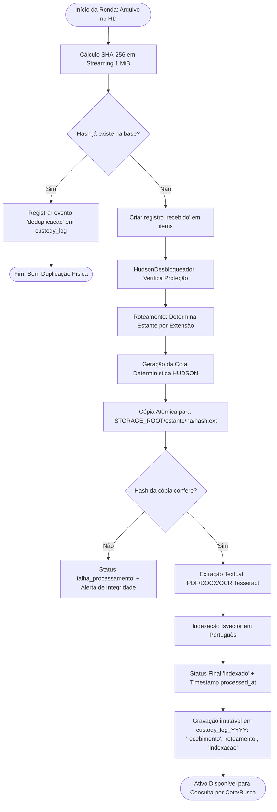

# ANÁLISE TÉCNICA E ARQUITETURAL: HUDSON DATA WAREHOUSE (HDW)
## IDENTIDADE, CUSTÓDIA ARQUIVÍSTICA FORENSE, ENGENHARIA DE PROCESSOS (BPM) E GOVERNANÇA DE DADOS

**Organização:** SUGOI S.A. & Daisugi Tecnologias  
**Segmento:** Construção Civil / Habitação de Interesse Social / Minha Casa Minha Vida (MCMV)  
**Coordenação:** PMO de Processos, Riscos & Governança de TI  
**Liderança de Engenharia:** Dr. Taylor (Especialista em DW & Arquitetura de Dados)  
**Especialidades Integradas:** Especialista em Processos & BPMN, Engenheiro de Software Senior e Compliance Forense  
**Ambiente Operacional:** Servidor Linux CentOS 7 Dedicado (`192.168.1.122`) — Rede Soberana On-Premises  
**Versão Homologada:** HUDSON v2.0 (Camada de Ingestão com Metadados Estendidos & Imutabilidade)  

---

## 🏛️ 1. O QUÊ? (Conceito, Identidade e Custódia Arquivística Forense)

### 1.1. Definição do HUDSON DW
O **HUDSON DW (HDW)** é a **Biblioteca Soberana e Cofre Digital Forense On-Premises** da SUGOI S.A.. Trata-se de um Data Warehouse documental imutável (*Append-Only*) concebido para concentrar, catalogar, proteger e certificar a autenticidade probatória de **100% dos ativos de informação, documentos e registros operacionais** da companhia.

Ele opera no ecossistema corporativo como a **Fonte Única da Verdade (*Single Source of Truth - SSOT*)**, executado sobre contêineres Docker isolados em ambiente Linux com banco relacional **PostgreSQL 18.6** (schema soberano `hudson`), expondo uma API HTTP de alta performance em **FastAPI** na porta `:8000`.

### 1.2. Fronteiras Arquiteturais Claras: HDW vs. HDC
Para assegurar a governança de infraestrutura, estabelece-se a divisão formal de responsabilidades:
* **HUDSON DW (HDW - Servidor Linux Local `192.168.1.122`):** É o **módulo soberano de custódia estrita, persistência física de binários, imutabilidade por banco e preservação probatória**. Ele não lida com atendimento ao público nem com a nuvem aberta; vive sob isolamento estrito de rede e só é acessível via OpenVPN.
* **HUDSON DC (HDC - Nuvem Oracle OCI `hudson.daisugi.com.br`):** É o **orquestrador multi-tenant, barramento de mensageria de alta velocidade e hub de eventos federados**, responsável por gerenciar chamadas externas, integrar com a recepção da **DAI** e despachar dados para os "HDWs filhotes" dos clientes.

---

### 1.3. Mapeamento do Acervo Institucional e Forense (SUGOI S.A. / MCMV)

O HDW é projetado para absorver, normalizar, indexar e blindar juridicamente todo e qualquer documento relevante para o ciclo de vida dos empreendimentos imobiliários:

```
                            ACERVO CORPORATIVO CUSTODIADO (HDW)
   ┌───────────────────────┬───────────────────────┬───────────────────────┐
   │ JURÍDICO & SOCIETÁRIO │ ENGENHARIA & PROJETOS │ QUALIDADE & AUDITORIA │
   │ - Contratos de Obras  │ - Plantas CAD / BIM   │ - FVS e RDO Diários   │
   │ - Aditivos / Distratos│ - Memoriais de Cálculo│ - Rompimento Concreto │
   │ - E-mails (.eml/.msg) │ - Vínculo com WBS     │ - Normas PBQP-H / CEF │
   └───────────────────────┴───────────────────────┴───────────────────────┘
   ┌───────────────────────────────────────────────┬───────────────────────┐
   │           FINANCEIRO, FISCAL & MEDIÇÃO        │  MEIO AMBIENTE & QSMS │
   │           - Medições de Empreiteiros / CCBs   │  - Licenças (LP/LI/LO)│
   │           - Notas Fiscais (XML / PDF)         │  - Fichas de EPI      │
   │           - Planilhas de Custo (.xlsx/.csv)   │  - Laudos PGR / PCMSO │
   └───────────────────────────────────────────────┴───────────────────────┘
```

| Categoria do Acervo | Tipos de Documentos e Formatos | Relevância Forense, Operacional e Normativa |
| :--- | :--- | :--- |
| **Jurídico, Societário e Contratual** | Contratos de empreitada, aditivos contratuais, distratos, notificações judiciais, procurações, atas de assembleia e comunicações eletrônicas (`.eml`, `.msg`, `.pst`). | Proteção jurídica e blindagem contra passivos cíveis e trabalhistas; prova de notificação prévia e histórico imutável de tratativas com empreiteiros e fornecedores. |
| **Engenharia e Projetos Executivos** | Plantas CAD e modelos BIM (`.dwg`, `.dxf`, `.rvt`, `.ifc`), memoriais descritivos, memoriais de cálculo e RDOs (Relatórios Diários de Obra). | Rastreabilidade milimétrica vinculada à Estrutura Analítica do Projeto (**WBS / `obra_wbs`**) para comprovação pericial de evolução de obra e validação de medições. |
| **Qualidade e Conformidade Técnica (PBQP-H / ISO 9001)** | Fichas de Verificação de Serviço (FVS), ensaios de rompimento de corpos de prova de concreto (FCK e slump test), ensaios de compactação de solo e laudos de sondagem. | Liberação obrigatória de parcelas de financiamento habitacional junto à **Caixa Econômica Federal (CEF)** e manutenção das certificações do PBQP-H Nível A. |
| **Financeiro, Contábil e Fiscal** | Boletins de medição de empreiteiros, Cédulas de Crédito Bancário (CCBs), notas fiscais eletrônicas (`.xml`, `.pdf`), guias tributárias e balancetes contábeis. | Auditoria de custos reais, eliminação de pagamentos em duplicidade e comprovação fiscal em auditorias da Receita Federal e auditorias externas independentes. |
| **Meio Ambiente e Segurança do Trabalho (QSMS)** | Licenças Ambientais (LP, LI, LO), Planos de Gerenciamento de Resíduos (PGRS), Programas de Gerenciamento de Riscos (PGR), PCMSO, fichas de entrega de EPIs e ASOs. | Mitigação de interdições de canteiro pelo Ministério do Trabalho e Emprego (MTE) e prevenção contra autuações por crimes ambientais. |

---

## ⚙️ 2. COMO? (Arquitetura de TI, Engenharia de Software e Especificações Técnicas)

### 2.1. Topologia de Camadas do HUDSON DW

```
                      ┌───────────────────────────────────────────────┐
                      │          SISTEMAS & AGENTES DE IA             │
                      │     (DAI, KAN-SA, Dr. SaulLM, Clientes OCI)   │
                      └───────────────────────┬───────────────────────┘
                                              │ Túnel OpenVPN (AES-256-CBC)
                                              ▼
                      ┌───────────────────────────────────────────────┐
                      │              CAMADA DE REDE E API             │
                      │        FastAPI HTTP REST (Porta :8000)        │
                      │    Autenticação X-API-Key / Rate Limiting     │
                      └───────┬───────────────────────────────┬───────┘
                              │                               │
              ┌───────────────┴──────────────┐ ┌──────────────┴──────────────┐
              │ CLI INGESTÃO (import_cli.py) │ │ MOTOR DE BUSCA & PROCESSAM.  │
              │ - Hash SHA-256 em Streaming   │ │ - Full-Text Search (tsvector)│
              │ - Captura de Metadados de SO │ │ - RapidFuzz (Busca Fuzzy)    │
              │ - HudsonDesbloqueador        │ │ - ChromaDB (Embeddings BGE)  │
              └───────────────┬──────────────┘ └──────────────┬──────────────┘
                              │                               │
                              ▼                               ▼
                      ┌───────────────────────────────────────────────┐
                      │            BANCO POSTGRESQL 18.6              │
                      │          Schema: hudson (Imutável)            │
                      │  - custody_log (Triggers Append-Only)         │
                      │  - items (21 colunas v2.0 / Sem DELETE)       │
                      │  - particionamento anual (2025/2026/2027)     │
                      └───────────────────────┬───────────────────────┘
                                              │ Deduplicação por Hash
                                              ▼
                      ┌───────────────────────────────────────────────┐
                      │            STORAGE FÍSICO SEGURO              │
                      │  /home/hudson/hudson_storage/<estante>/<ha>/  │
                      │  Gravação definitiva do arquivo: <hash>.<ext> │
                      └───────────────────────────────────────────────┘
```

---

### 2.2. Tecnologias e Componentes do Backend
1. **API REST Soberana (`app/main.py`, `app/routers/`):**
   * Implementada em **FastAPI** assíncrono executando via Uvicorn na porta interna `8000`.
   * Rotas ativas em produção:
     * `GET /health`: Healthcheck de infraestrutura (container e pool de conexões).
     * `GET /items/{cota}`: Recuperação de metadados e localização do binário por cota determinística. Gera evento `consulta` no log.
     * `GET /search`: Motor de busca textual com query em linguagem natural, ranking `ts_rank` e limite configurável. Gera evento `consulta` no log.
     * `GET /authenticity` (roadmap/perícia): Recálculo em tempo real do SHA-256 em disco e confronto com o primeiro registro de custódia.
2. **CLI de Ingestão e Ronda de Metadados (`scripts/import_cli.py` & `app/services/importer.py`):**
   * Opera em streaming com chunks de 1 MiB via `hashlib.sha256()`.
   * **Inovação v2.0:** Captura metadados forenses do sistema de arquivos de origem (`st_mtime`, tamanho em bytes, caminho original, nome original do arquivo, usuário operador e hostname de origem).
   * Rastreia o lote operacional através do parâmetro obrigatório `--ronda` (ex: `RONDA-OBRA-FLORES-2026-10-09`).
3. **Arsenal Forense de Desbloqueio (*HudsonDesbloqueador*):**
   * Módulo pré-processador que inspeciona arquivos protegidos por senha de leitura ou restrições de impressão, normalizando o conteúdo textual antes da extração via `pypdf`, `python-docx` e `tesseract-ocr`.
4. **PostgreSQL 18.6 com Imutabilidade Nativa:**
   * Executado no contêiner `sugoi-postgres` com volume persistente montado em `/var/lib/postgresql/data`.
   * Schema `hudson` contendo 9 tabelas estruturadas, com triggers em PL/pgSQL que interceptam e abortam qualquer instrução destrutiva (`UPDATE` ou `DELETE`).
5. **Motor de Busca Híbrido:**
   * **Full-Text Search (FTS):** Dicionário `portuguese` do PostgreSQL convertendo textos extraídos em colunas `tsvector` com índice GIN/GiST.
   * **RapidFuzz:** Algoritmo de correspondência fuzzy baseado na distância de Levenshtein para identificar arquivos com variações ortográficas no nome original.
   * **Embeddings Locais:** Integração arquitetural com modelos locais *BGE-M3* e base vetorial *ChromaDB*, garantindo que nenhuma informação corporativa confidencial seja enviada para APIs externas de LLM.

---

### 2.3. Especificações Técnicas e as 7 Regras Arquivísticas Invioláveis

#### Regra 1: Custódia Imutável (*Append-Only*)
A tabela `hudson.custody_log` é particionada por ano (`custody_log_2025`, `custody_log_2026`, `custody_log_2027`). Qualquer instrução `UPDATE` ou `DELETE` é bloqueada pelos gatilhos:
```sql
CREATE OR REPLACE FUNCTION hudson.bloquear_update_delete_custody_log()
RETURNS trigger AS $$
BEGIN
    RAISE EXCEPTION 'VIOLAÇÃO DE CUSTÓDIA: Registros de custódia no HDW são 100% imutáveis e não podem ser alterados ou deletados.';
END;
$$ LANGUAGE plpgsql;
```
A tabela `hudson.items` conta com o gatilho `items_bloqueia_delete`, impedindo a destruição de registros de catálogo.

#### Regra 2: Zero Exclusão de Binários (*No-Delete Physical Storage*)
Nenhum arquivo gravado no diretório de armazenamento (`STORAGE_ROOT`) pode ser excluído. Mesmo que um documento seja considerado "obsoleto" ou "cancelado" pelo negócio, seu binário e hash permanecem arquivados como registro histórico pericial.

#### Regra 3: Deduplicação Criptográfica por Hash SHA-256
Durante a varredura, o hash SHA-256 de 256 bits é calculado. Se o hash já existir no catálogo (`items.hash_sha256`), o sistema **não grava duplicatas físicas no disco**. Em vez disso, ele:
1. Reutiliza o arquivo físico existente;
2. Gera um evento de custódia do tipo `deduplicacao`;
3. Registra a cota duplicada ou vincula a referência ao item primário via `duplicate_of_item_id`.

#### Regra 4: Cota HUDSON Determinística
Todo ativo digital custodiado recebe uma **Cota Soberana** única e padronizada:
$$\text{COTA} = \text{[ESTANTE]}-\text{[WBS]}-\text{[ANO]}-\text{[HASH8]}$$
*Exemplo:* `document_text-OBRA-FLORES-2026-464468e2`  
Se ocorrer colisão dos 8 primeiros caracteres hexadecimais, o algoritmo expande automaticamente o sufixo do hash de 2 em 2 caracteres até 64.

#### Regra 5: Classificação em 6 Estantes Temáticas
Os arquivos são catalogados e roteados em diretórios físicos pelo seu tipo e extensão:
1. `document_text`: `.pdf`, `.doc`, `.docx`, `.odt`, `.rtf`, `.txt` (Extração de texto via OCR Tesseract / pypdf).
2. `communication`: `.eml`, `.msg`, `.pst` (Comunicações eletrônicas e correios corporativos).
3. `engineering_drawings`: `.dwg`, `.dxf`, `.rvt`, `.ifc` (Desenhos técnicos e modelos de engenharia).
4. `structured_data`: `.xls`, `.xlsx`, `.csv`, `.xml`, `.json` (Planilhas e dados estruturados).
5. `image`: `.jpg`, `.jpeg`, `.png`, `.tif`, `.tiff`, `.bmp` (Imagens de vistoria com OCR).
6. `audio_video`: `.mp3`, `.wav`, `.mp4`, `.avi`, `.mov` (Áudios de reuniões e vídeos de canteiro).

#### Regra 6: Rastreabilidade por Rodada (`ronda_id`)
Toda operação de importação é associada a um identificador de lote (`ronda_id`), permitindo ao PMO auditar:
* Quem foi o operador que executou a carga (`usuario_captura`);
* Em qual máquina a importação ocorreu (`maquina_origem`);
* Qual foi o caminho de pasta original no disco de origem (`caminho_origem`);
* Quais arquivos foram desbloqueados e por qual método (`status_desbloqueio`).

#### Regra 7: Segurança de Perímetro e Autenticação
* O acesso de fora para o servidor Linux requer túnel criptografado via **OpenVPN** com chaves dedicadas (`hudson_vpn.ovpn`).
* Acesso à API HTTP requer autenticação através do header seguro `X-API-Key`.
* Todas as portas de banco de dados (5432) e API (8000) operam estritamente protegidas na rede privada interna.

---

### 2.4. Ciclo de Vida do Ativo de Informação (Workflow BPMN da Ingestão)



---

## 🎯 3. PORQUÊ? (Dores Resolvidas, Propósito Empresarial e Atendimento BPM/ISO)

### 3.1. Matriz de Dores Organizacionais: Cenário Anterior vs. HUDSON DW

```
                      TRANSFORMAÇÃO ESTATUTÁRIA DA CUSTÓDIA
   ┌───────────────────────────────────┐       ┌───────────────────────────────────┐
   │       ANTES (RISCO & CAOS)        │  ──►  │       COM HDW (BLINDAGEM)         │
   ├───────────────────────────────────┤       ├───────────────────────────────────┤
   │ • Arquivos dispersos em pastas    │       │ • Repositório único SSOT por WBS  │
   │ • Contratos deletados ou editados │       │ • Imutabilidade física e em banco │
   │ • Lentidão em perícias judiciais  │       │ • Certidão de autenticidade rápida│
   │ • Reprovações em auditorias CEF   │       │ • Rastreabilidade PBQP-H / FVS    │
   │ • IAs consumindo dados incertos   │       │ • Contexto seguro via API/OpenVPN │
   └───────────────────────────────────┘       └───────────────────────────────────┘
```

| Dimensão de Governança | Cenário Anterior (Vulnerabilidade Crítica) | Cenário com o HUDSON DW (Solução Soberana) |
| :--- | :--- | :--- |
| **Integridade de Contratos** | Contratos e aditivos eram salvos em diretórios compartilhados de rede com permissão de escrita para múltiplos usuários, gerando risco de alteração acidental ou exclusão maliciosa. | **Cadeia de Custódia Forense:** O arquivo é transformado em objeto somente-leitura identificado pelo seu hash SHA-256. Triggers em banco impedem a exclusão e garantem validade pericial. |
| **Comprovação em Litígios Judiciais** | Em disputas trabalhistas ou contratuais, a localização de e-mails antigos e aditivos assinados levava semanas, frequentemente resultando em condenações por falta de prova tempestiva. | **Certidão Pericial Imediata:** A rota `/authenticity` confronta o arquivo com seu registro histórico de custódia e emite atestado de integridade com data/hora forense inquestionável. |
| **Auditorias da Caixa Econômica (MCMV)** | Fichas de Verificação de Serviço (FVS) e laudos de rompimento de concreto (FCK) ficavam fragmentados nos canteiros, atrasando a medição mensal da CEF e travando o fluxo de caixa. | **Indexação por Obra (WBS):** Todo laudo e FVS é vinculado ao WBS da obra (`obra_wbs`), permitindo ao engenheiro e ao auditor extrair o dossiê da medição em segundos. |
| **Auditorias PBQP-H e ISO 9001** | Amostragem de registros manuais em papel causava não-conformidades de auditoria devido a fichas rasuradas ou extraviadas. | **Rastreabilidade Digital Completa:** Conformidade assegurada com os requisitos de controle de informação documentada (ISO 9001:2015, item 7.5). |
| **Segurança para IA Corporativa** | Agentes de Inteligência Artificial dependiam de pastas soltas, com risco de alucinação ou vazamento de dados estratégicos para a internet. | **Consumo Seguro via API REST:** DAI, Kan-sa e Dr. SaulLM consultam a API via túnel OpenVPN, operando sobre documentos auditados e mantendo dados sigilosos dentro do servidor. |

---

### 3.2. Níveis de Serviço (SLA / SLO) e Governança Operacional

* **RPO (Recovery Point Objective):** **Zero (0)**. Cada evento de custódia possui transação própria com `commit` no banco de dados.
* **RTO (Recovery Time Objective):** **< 1 hora**. Restauração de desastre validada através de dumps em formato binário comprimido (`pg_dump -Fc`) e espelhamento diário do `STORAGE_ROOT`.
* **Tempo Médio de Consulta na API:**
  * Busca por cota (`GET /items/{cota}`): **< 25 ms** (Indexação B-tree direta).
  * Busca textual com ranking (`GET /search`): **< 120 ms** (Índice GIN `tsvector`).
* **Disponibilidade da Infraestrutura (Uptime):** **99.9%** em rede local corporativa.

---

### 3.3. Quem o HDW Atende? (Mapeamento de Stakeholders)

```
                                  STAKEHOLDERS DO HDW
                                           │
         ┌──────────────────┬──────────────┴─────┬──────────────────┐
         ▼                  ▼                    ▼                  ▼
   ENGENHARIA E       JURÍDICO E           AUDITORIA E          AGENTES DE IA
    QUALIDADE         COMPLIANCE            ÓRGÃOS EXT.         (DAI / KAN-SA)
  (FVS, Projetos,    (Perícias, Provas,   (Caixa, PBQP-H,      (Consultas REST,
   WBS, Medições)     Contratos, E-mails)  Receita Federal)     Contexto Soberano)
```

1. **Engenheiros de Obra, Gestores de Contrato e Fiscais de Campo:**
   * Utilizam o HDW para depositar e recuperar plantas CAD/BIM atualizadas, memoriais de cálculo, relatórios diários (RDO) e aprovações de medição vinculadas ao código WBS do empreendimento.
2. **Departamento Jurídico e Compliance Corporativo:**
   * Utilizam o acervo para resguardar a empresa contra litígios societários, execuções trabalhistas e disputas com empreiteiros, obtendo certidões com hash SHA-256 aceitas como prova pericial em juízo.
3. **Auditores de Qualidade (PBQP-H, ISO 9001) e Agentes Financeiros (Caixa Econômica Federal):**
   * Consultam diretamente a trilha imutável dos ensaios de rompimento de concreto (FCK/slump) e relatórios de sondagem para homologar as medições e liberar repasses de crédito imobiliário.
4. **Agentes de Inteligência Artificial Autônomos (DAI, KAN-SA e Dr. SaulLM):**
   * Consomem a base documental por API REST em alta velocidade para responder a dúvidas de clientes, cruzar inconsistências em contratos e gerar relatórios periciais automatizados.

---

## 4. 📝 CONCLUSÃO DO PMO E CERTIFICAÇÃO DE IDENTIDADE

O **HUDSON DW** não é um repositório convencional de arquivos, mas a **infraestrutura definitiva de custódia forense, inteligência arquivística e soberania de dados** da SUGOI S.A.. Com sua arquitetura de microsserviços blindada por gatilhos de banco de dados, enriquecimento de metadados v2.0 e isolamento de rede por OpenVPN, o HDW estabelece o mais alto padrão de conformidade e segurança da indústria da construção civil brasileira.
